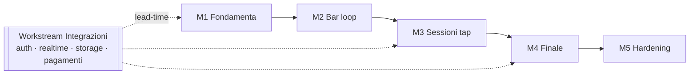
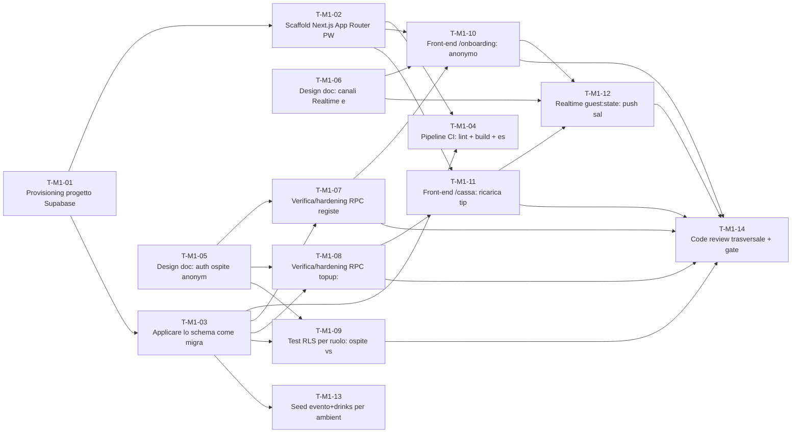
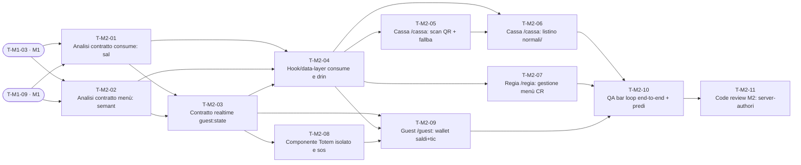
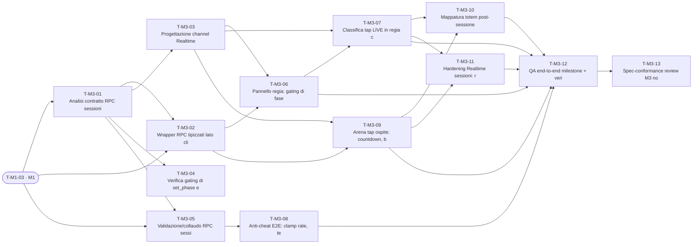
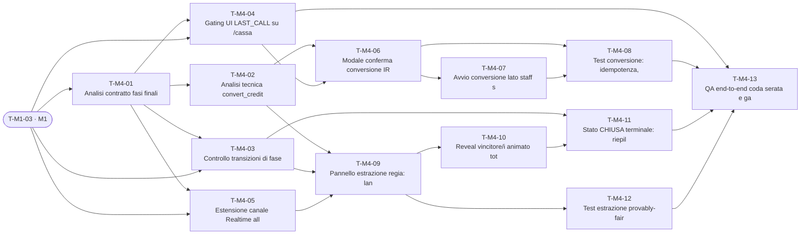
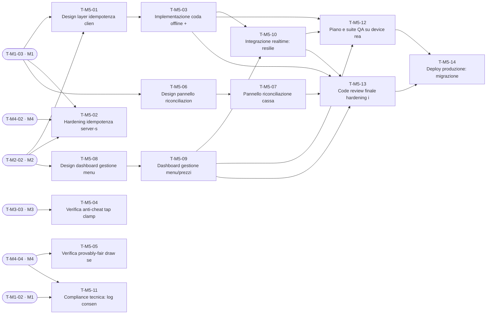

# TOTEM NIGHT — PLAN.md

> **Piano di implementazione end-to-end** dell'intera piattaforma, prodotto dal team multi-agente **hull** (10 sub-agent) a partire dallo Spec Pack.
> **Fonte di verità di prodotto:** `docs/totem-night-spec-pack.md` (§1–13).
> **Contratto tecnico autoritativo:** `docs/totem-night_db_schema.sql` — **v0.2** — 14 RPC `SECURITY DEFINER` + RLS + 4 helper (`current_event()` aggiunto).
> **Flussi:** `docs/totem-night_flussi.md` · **Branding placeholder:** `docs/totem-night_branding.md` · **T&C:** `docs/totem-night_termini-e-condizioni_BOZZA.md`.
>
> ✅ **PIANO APPROVATO (2026-06-24).** Schema → **v0.2**; le 10 Open Questions sono **risolte** (§13 + [`docs/design/v0.2-reconciliation.md`](docs/design/v0.2-reconciliation.md)). **M1-S1 avviato e verde** (§14): scaffold PWA build ✓, migrazione clean-apply + contract assert ✓.

Generato coordinando: `@plan-architect` (backbone M1–M5), `@orchestrator` (delega), `@spec-guardian` (citazioni/gap/OQ), `@backend-analyst` ∥ `@frontend-analyst` (design doc), `@integration-specialist`, `@test-strategist`, `@code-reviewer`.

---

## 0. Come leggere il piano

- **65 task** su 5 milestone (M1–M5), 3 sprint ciascuna. ID task: `T-Mx-NN`. ID sprint: `Mx-Sn`.
- Ogni task riporta: **Layer** · **Owner** (sub-agent hull) · **Dipende da** · **Tipo dip.** · **∥** (parallelizzabile) · **Spec/RPC** · **Accettazione** · **Test gate** · **Effort** (S/M/L).
- **Tipo dipendenza:** `design` = basta il design doc del task a monte (può correre in parallelo all'implementazione a monte) · `code` = serve l'artefatto/codice prodotto a monte · `mixed` · `none`.
- I valori numerici (prezzi, ticket, durate) **vivono nella tabella `events`** e si cambiano a runtime via `update_event_settings` — mai hardcoded nel client.
- 🔢 *Nota di normalizzazione:* due dipendenze cross-milestone prodotte come placeholder dagli agenti paralleli sono state rimappate — `T-M1-SCHEMA`→`T-M1-03`, `T-M1-RLS`→`T-M1-09`.

### Indice
1. Vincoli non negoziabili · 2. Convenzioni hull · 3. Workstream trasversali · 4. Roadmap milestone · 5. Backbone dettagliato (M1–M5) · 6. Grafo dipendenze · 7. Matrice agente↔task · 8. Piano di delega (orchestrator) · 9. Integrazioni · 10. Strategia test & CI · 11. Checklist review · 12. Registro rischi · 13. Open Questions & gap · 14. Primo sprint M1-S1 · 15. Design doc (link)

---

## 1. Vincoli non negoziabili

1. **Schema SQL = fonte di verità.** Il front-end **non ricalcola mai** saldi/ticket. Tutte le scritture passano dalle 14 RPC: `register_guest`, `topup`, `consume`, `set_phase`, `start_session`, `register_taps`, `close_session`, `convert_credit`, `run_draw`, `update_event_settings`, `upsert_drink`, `set_drink_visibility`, `set_drink_active`, `delete_drink`. Stato live via **Supabase Realtime**.
2. **Stack:** Next.js (App Router) **PWA mobile-first** + Supabase (Postgres + Realtime + RLS). Route: `/onboarding`, `/guest`, `/cassa`, `/regia`.
3. **Auth:** Anonymous sign-in per l'ospite; staff con claim `app_metadata.role ∈ {cassa,regia,admin}`; schema applicato come **migrazione singola**.
4. **Totem:** componente **isolato e sostituibile**; demo = **modello totem africano placeholder**; livelli **0–6** mappati su `guests.livello_totem` via `totem_level()` (0 / ≥1 / ≥2 / ≥5 / ≥8 / ≥12 / ≥20).
5. **Branding placeholder:** colori in token `:root`, nome app in config.
6. **Operazioni gated per fase** (SETUP→APERTA→LAST_CALL→ESTRAZIONE→CHIUSA); **anti-cheat tap server-authoritative** (clamp `max_tap_al_secondo` + tetto sessione; ticket assegnati solo a `close_session`).

---

## 2. Convenzioni hull (date per scontate dagli agenti)

- **Fonte di verità:** ogni agente cerca `*spec-pack*.md` (root → `/docs` → `/specs`). Qui: `docs/totem-night-spec-pack.md`. Citazioni per § e per nome RPC.
- **Un subagent NON può spawnarne un altro.** `@orchestrator` produce un **piano di delega** (§8) che la **main session esegue turno per turno**. Nessuna catena automatica.
- **Memory `project`** attiva su 4 agenti: `spec-guardian`, `code-reviewer`, `integration-specialist`, `test-strategist` → `.claude/agent-memory/` (committare). Aggiungere `.claude/agent-memory-local/` a `.gitignore`.
- **Lingua:** risposte in italiano; identificatori tecnici (RPC, §, framework, path) in inglese.
- **Fasi prodotto:** non promuovere lavoro di milestone successive senza override esplicito.
- **Setup:** `git init` (repo non ancora inizializzato), poi committare `.claude/agents/` per condivisione team. Riavviare Claude Code e verificare con `/agents`.

---

## 3. Workstream trasversali (in parallelo alle milestone)

| Workstream | Contenuto | Dove ricade |
|---|---|---|
| **Infra/DevOps** | repo scaffold, CI, progetto Supabase, migrazione, env/secrets, deploy | M1 (setup), M5 (deploy) |
| **Design system & Totem** | token colore/tipografia (`:root`), componente Totem africano demo sostituibile, livelli 0–6, motion *ignite / tap-burst / count-up / reveal* | M1→M4 (cresce con le feature) |
| **Realtime** | canali `event:phase`, `session:state`, `session:leaderboard`, `guest:state`, `admin:stats` | M1 (guest:state), M3 (session), M4 (draw), M5 (resilienza) |
| **Integrità & anti-cheat** | validazione tap server-side, idempotenza pagamenti, riconciliazione cassa | M3, M5 |
| **QA & sicurezza** | contract test RPC, RLS per ruolo, estrazione provably-fair, e2e device | ogni milestone |
| **Predisposizioni compliance** (tecniche) | log `consenso_tos_at`, seed+snapshot estrazione (`draws`) | M1, M4 |

---

## 4. Roadmap milestone — overview

| Milestone | Obiettivo | Sprint | Task | RPC chiave |
|---|---|:--:|:--:|---|
| **M1** Fondamenta | Stabilire le fondamenta server-authoritative di Totem Night: schema Supabase applicato come migrazione singola (14 RPC +… | 3 | 14 | register_guest, topup |
| **M2** Bar loop | Chiudere il ciclo bar: la cassa scansiona QR/PIN dell'ospite e registra una consumazione dal listino (normali/premium) v… | 3 | 11 | consume, upsert_drink, set_drink_visibility/active, delete_drink |
| **M3** Sessioni tap | Abilitare il flusso completo delle sessioni di tap: la regia lancia/chiude le finestre a tempo (gating per fase APERTA),… | 3 | 13 | set_phase, start_session, register_taps, close_session |
| **M4** Finale | Implementare l'intera coda della serata: la regia porta l'evento da APERTA a LAST_CALL (ricariche e bar OFF, solo conver… | 3 | 13 | convert_credit, run_draw |
| **M5** Hardening | Rendere Totem Night production-ready: idempotenza end-to-end con idem key generate dal client su tutte le RPC mutanti (t… | 3 | 14 | update_event_settings + tutte (hardening) |

**Critical path (alto livello):** M1 (schema+auth+wallet) → M2 (consume+totem) → M3 (sessioni tap+anti-cheat) → M4 (conversione+estrazione) → M5 (hardening+deploy). Il workstream **Integrazioni** (auth, realtime, storage, pagamenti) corre in parallelo con lead-time da prenotare al giorno 1 (§9).

---

## 5. Backbone dettagliato (M1–M5)

### M1 — Fondamenta

**Obiettivo.** Stabilire le fondamenta server-authoritative di Totem Night: schema Supabase applicato come migrazione singola (14 RPC + RLS + grants + helper), autenticazione anonima ospite e ruoli staff via app_metadata.role, scaffold Next.js PWA con CI e secrets, onboarding+T&C tramite register_guest (con log consenso_tos_at) e ricarica cassa tramite topup (idempotente, gated su fase APERTA, riconciliazione importo_euro). Al termine della milestone un ospite puo registrarsi accettando i T&C e la cassa puo accreditargli consumazioni in modo atomico e tracciato, con saldi/ticket mai calcolati dal front-end.

**Definition of Done (milestone):**
- La migrazione SQL (totem-night_db_schema.sql) si applica pulita su un progetto Supabase fresco: 7 tabelle, 3 helper (app_role/is_staff/totem_level), 14 RPC SECURITY DEFINER, RLS default-deny con sole SELECT mirate, grants ad anon/authenticated; rieseguibile (idempotente) senza errori.
- Anonymous sign-in funziona per l'ospite (auth.uid presente) e gli account staff portano il claim app_metadata.role IN (cassa,regia,admin); RLS test dimostrano che l'ospite legge solo i propri guests/transactions/taps e che il menu nasconde le voci non visibili ai non-staff.
- Flusso onboarding completo: /onboarding fa sign-in anonimo, mostra T&C, alla conferma chiama register_guest e persiste consenso_tos_at; chiamata ripetuta e idempotente (stesso guest, nessun duplicato per event_id+auth_uid).
- Flusso ricarica completo su /cassa: topup accredita saldo_normale/saldo_premium solo in fase APERTA, e idempotente sull'idem key (retry di rete non raddoppia), registra importo_euro per riconciliazione e operatore=auth.uid(); push realtime guest:state aggiorna il saldo sul telefono ospite.
- Repo Next.js PWA scaffoldato (route /onboarding /guest /cassa /regia, manifest+service worker, token branding in :root, nome app in config), CI verde (lint+build+contract/RLS test), env/secrets configurati per ambienti; nessun saldo/ticket calcolato lato client.
- Suite di test fondazionale verde: contract test su register_guest e topup, idempotenza retry topup, gating fase (topup negato fuori APERTA), RLS per ruolo ospite vs staff, riconciliazione importo_euro.

#### M1-S1 — Predisporre l'infrastruttura e il contratto tecnico: progetto Supabase, schema applicato come migrazione singola, scaffold Next.js PWA, CI e secrets, piu i design doc di auth/realtime/anti-cheat che sbloccano gli sprint successivi.

- **T-M1-01 — Provisioning progetto Supabase + gestione env/secrets per ambienti**  ·  `ops` · owner **@integration-specialist** · effort **M** · ∥ ✅
  - **Dipende da:** —  *(none)*
  - **Spec/RPC:** spec-pack §9 Stack; schema §0 modello auth
  - **Accettazione:** Progetto Supabase creato (dev + staging) con Postgres+Realtime+Auth attivi; URL e anon key + service_role key archiviate come secrets, mai committate  ·  Anonymous sign-in abilitato nelle impostazioni Auth Supabase  ·  Documento env (.env.example) elenca SUPABASE_URL, SUPABASE_ANON_KEY, SUPABASE_SERVICE_ROLE_KEY e flag branding/nome app
  - **Test gate:** smoke connessione client a Supabase con anon key
- **T-M1-02 — Scaffold Next.js (App Router) PWA mobile-first con route e token branding**  ·  `frontend` · owner **@frontend-implementer** · effort **M** · ∥ ❌
  - **Dipende da:** T-M1-01  *(code)*
  - **Spec/RPC:** spec-pack §9 struttura /app; spec-pack §2 attori/viste; spec-pack §5 branding placeholder
  - **Accettazione:** Route /onboarding /guest /cassa /regia esistono e renderizzano placeholder mobile-first  ·  PWA: manifest + service worker registrato, installabile, no-install per l'ospite; lib/supabase client inizializzato  ·  Token colore in :root e nome app in config centralizzato (branding placeholder sostituibile)
  - **Test gate:** build PWA verde; lighthouse PWA installabile (smoke)
- **T-M1-03 — Applicare lo schema come migrazione singola idempotente su Supabase**  ·  `backend` · owner **@backend-implementer** · effort **M** · ∥ ✅
  - **Dipende da:** T-M1-01  *(code)*
  - **Spec/RPC:** totem-night_db_schema.sql §1-5; app_role(); is_staff(); totem_level(); register_guest; topup; consume; convert_credit; set_phase; start_session; register_taps; close_session; run_draw; update_event_settings; upsert_drink; set_drink_visibility; set_drink_active; delete_drink
  - **Accettazione:** psql -f applica lo schema su DB fresco senza errori: 7 tabelle, 3 helper, 14 RPC, indici, RLS, grants  ·  Riesecuzione della migrazione non genera errori (create ... if not exists / or replace)  ·  Verifica presenza dei 14 RPC e dei grant execute ad authenticated via query di introspezione
  - **Test gate:** migrazione applica clean su DB vuoto; re-run idempotente; introspezione: 14 RPC + grants presenti
- **T-M1-04 — Pipeline CI: lint + build + esecuzione test contratto/RLS contro Supabase effimero**  ·  `ops` · owner **@integration-specialist** · effort **M** · ∥ ❌
  - **Dipende da:** T-M1-02, T-M1-03  *(code)*
  - **Spec/RPC:** spec-pack §9 Stack; spec-pack §12 ordine di build
  - **Accettazione:** CI esegue su PR: install, lint, build Next.js, applicazione migrazione su DB effimero, run test suite  ·  CI fallisce se la migrazione non applica o un contract/RLS test rompe  ·  Secrets iniettati in CI da store sicuro, non in chiaro nel repo
  - **Test gate:** pipeline verde end-to-end su PR di esempio
- **T-M1-05 — Design doc: auth ospite (anonymous) + ruoli staff (app_metadata.role) + procedura set claim**  ·  `docs` · owner **@backend-analyst** · effort **S** · ∥ ✅
  - **Dipende da:** —  *(none)*
  - **Spec/RPC:** schema §0 modello auth; app_role(); is_staff(); spec-pack §9 RLS
  - **Accettazione:** Documento descrive: anonymous sign-in per ospite (auth.uid -> guests.auth_uid), creazione account staff e set di app_metadata.role IN (cassa,regia,admin) via Admin API/dashboard  ·  Mappa quale RPC richiede quale ruolo (is_staff, is_staff('regia')) e cosa puo leggere ciascun ruolo via RLS  ·  Definisce matrice di test ruolo->permesso da usare in T-M1-09
  - **Test gate:** review spec-guardian: coerenza con schema RPC/RLS
- **T-M1-06 — Design doc: canali Realtime e contratto eventi (guest:state, event:phase, admin:stats)**  ·  `docs` · owner **@frontend-analyst** · effort **S** · ∥ ✅
  - **Dipende da:** —  *(none)*
  - **Spec/RPC:** spec-pack §8 real-time canali/eventi; flussi §4 ricarica push; flussi §1 mappa realtime
  - **Accettazione:** Documento mappa ogni canale (event:phase, guest:state, session:state, session:leaderboard, admin:stats) alla tabella/riga Supabase che lo alimenta  ·  Specifica per M1 il canale guest:state (push privato saldo/ticket/totem all'ospite via row change su guests) e event:phase  ·  Definisce strategia di subscribe lato client (filtri RLS-aware) e teardown
  - **Test gate:** review spec-guardian: nessuna logica di gioco sul client

#### M1-S2 — Hardening del contratto backend di M1: blindare register_guest (idempotenza + consenso_tos_at) e topup (idempotenza idem, gating APERTA, riconciliazione importo_euro), piu suite contract/RLS che diventa il gate di qualita della milestone.

- **T-M1-07 — Verifica/hardening RPC register_guest: idempotenza e log consenso_tos_at**  ·  `backend` · owner **@backend-implementer** · effort **S** · ∥ ✅
  - **Dipende da:** T-M1-03, T-M1-05  *(mixed)*
  - **Spec/RPC:** register_guest; schema guests.consenso_tos_at; spec-pack §7.1 onboarding+consenso; flussi §3 onboarding
  - **Accettazione:** register_guest richiede auth.uid (anonymous), crea una sola riga per (event_id, auth_uid) e su seconda chiamata restituisce la stessa riga senza duplicare  ·  consenso_tos_at popolato a now() alla registrazione; pin a 4 cifre generato; saldi e ticket inizializzati a 0  ·  Tentativo senza autenticazione fallisce con errore esplicito
  - **Test gate:** contract test register_guest; idempotenza re-call (no duplicati); compliance: consenso_tos_at non null
- **T-M1-08 — Verifica/hardening RPC topup: idempotenza idem, gating fase APERTA, riconciliazione importo_euro, operatore**  ·  `backend` · owner **@backend-implementer** · effort **M** · ∥ ✅
  - **Dipende da:** T-M1-03, T-M1-05  *(mixed)*
  - **Spec/RPC:** topup; schema transactions.importo_euro; spec-pack §7.2 ricarica; spec-pack §3 fasi; spec-pack §5 idempotenza; flussi §4 ricarica
  - **Accettazione:** topup eseguibile solo da staff (is_staff) e solo in fase APERTA; negato con errore in SETUP/LAST_CALL/ESTRAZIONE/CHIUSA  ·  Retry con stesso p_idem restituisce la stessa transaction senza ri-accreditare il saldo; qta<=0 e tipo non valido rifiutati  ·  Transazione registra tipo='ricarica', tipo_consumazione, qta_delta, importo_euro e operatore=auth.uid() per riconciliazione cassa; saldo del tipo corrispondente incrementato atomicamente (FOR UPDATE)
  - **Test gate:** contract test topup; idempotenza retry topup; gating fase (topup negato fuori APERTA); riconciliazione importo_euro
- **T-M1-09 — Test RLS per ruolo: ospite vs staff su guests/transactions/taps/drinks + verifica deny scritture dirette**  ·  `backend` · owner **@test-strategist** · effort **M** · ∥ ✅
  - **Dipende da:** T-M1-03, T-M1-05  *(mixed)*
  - **Spec/RPC:** schema §3 RLS; guests_select; tx_select; taps_select; drinks_select; spec-pack §9 RLS
  - **Accettazione:** Ospite legge solo i propri guests/transactions/taps; vede solo drinks con visibile=true; non vede dati altrui  ·  Staff (cassa/regia/admin) legge tutti i guests/transactions/taps e tutto il menu  ·  INSERT/UPDATE/DELETE diretti su qualsiasi tabella sono negati a ospite e staff (passano solo gli RPC)
  - **Test gate:** RLS test ruolo ospite; RLS test ruolo staff; deny scritture dirette

#### M1-S3 — Cablare il front-end ai due flussi vivi di M1: onboarding+T&C dell'ospite e ricarica della cassa, con realtime guest:state, e chiudere con review trasversale e gate di qualita della milestone.

- **T-M1-10 — Front-end /onboarding: anonymous sign-in + schermata T&C + register_guest**  ·  `frontend` · owner **@frontend-implementer** · effort **M** · ∥ ✅
  - **Dipende da:** T-M1-02, T-M1-06, T-M1-07  *(mixed)*
  - **Spec/RPC:** spec-pack §7.1 onboarding+consenso; flussi §3 onboarding; register_guest; spec-pack §10 schermate ospite; spec-pack §11 T&C/privacy
  - **Accettazione:** Apertura link/QR -> anonymous sign-in; schermata nome + accettazione T&C (no rimborso, regole estrazione, privacy) obbligatoria prima di procedere  ·  Alla conferma chiama register_guest(event, nome); mostra totem livello 0 + PIN/QR personale; nessun saldo/ticket calcolato dal client  ·  Re-ingresso dello stesso ospite non crea duplicati (riusa la riga esistente)
  - **Test gate:** e2e onboarding happy path; T&C obbligatorio (no consenso -> no register_guest)
- **T-M1-11 — Front-end /cassa: ricarica (tipo + quantita + importo) via topup con idem key e feedback transazione**  ·  `frontend` · owner **@frontend-implementer** · effort **M** · ∥ ✅
  - **Dipende da:** T-M1-02, T-M1-08  *(mixed)*
  - **Spec/RPC:** spec-pack §7.2 ricarica; flussi §4 ricarica; topup; spec-pack §10 schermate cassa; spec-pack §5 idempotenza
  - **Accettazione:** Cassa seleziona/cerca ospite, sceglie tipo (normale/premium), quantita e importo_euro incassato; genera p_idem univoco lato client per la chiamata  ·  Chiamata topup mostra esito (saldo aggiornato o errore di fase/permesso); retry su rete instabile usa lo stesso idem (no doppio addebito)  ·  Accesso /cassa consentito solo ad account con ruolo staff
  - **Test gate:** e2e ricarica happy path; idempotenza retry lato client (stesso idem); gating ruolo cassa
- **T-M1-12 — Realtime guest:state: push saldo/ticket/totem al telefono ospite dopo topup**  ·  `frontend` · owner **@integration-specialist** · effort **M** · ∥ ❌
  - **Dipende da:** T-M1-06, T-M1-10, T-M1-11  *(code)*
  - **Spec/RPC:** spec-pack §8 guest:state; flussi §4 push realtime; schema guests RLS guests_select
  - **Accettazione:** L'ospite e iscritto al canale guest:state (row change su guests filtrato dalla RLS) e vede aggiornarsi saldo_normale/saldo_premium dopo una ricarica della cassa, senza refresh  ·  La subscription rispetta la RLS (l'ospite riceve solo la propria riga) e fa teardown su unmount  ·  Nessun ricalcolo client: i valori mostrati provengono dalla riga guests
  - **Test gate:** e2e realtime: topup cassa -> update saldo ospite; subscription RLS-aware (no leak altrui)
- **T-M1-13 — Seed evento+drinks per ambienti non-prod e snapshot baseline per flussi futuri (draw)**  ·  `ops` · owner **@backend-implementer** · effort **S** · ∥ ✅
  - **Dipende da:** T-M1-03  *(code)*
  - **Spec/RPC:** schema §6 seed opzionale; spec-pack §6 modello dati; spec-pack §13 default configurabili
  - **Accettazione:** Script di seed (solo dev/staging, escluso da prod) crea un evento di test in fase APERTA e un set di drinks normale/premium  ·  Default configurabili (prezzi/ticket) leggibili dalla tabella events; nessun valore hardcoded nel client  ·  Seed rieseguibile senza duplicare l'evento di test
  - **Test gate:** seed applica su dev senza errori; seed non incluso nel bundle prod
- **T-M1-14 — Code review trasversale + gate qualita milestone (sicurezza RLS, server-authoritative, no ricalcoli client)**  ·  `shared` · owner **@code-reviewer** · effort **S** · ∥ ❌
  - **Dipende da:** T-M1-07, T-M1-08, T-M1-09, T-M1-10, T-M1-11, T-M1-12  *(code)*
  - **Spec/RPC:** spec-pack §5 anti-abuso/fairness; spec-pack §9 server-authoritative; schema §0 regola d'oro; spec-pack §11 compliance
  - **Accettazione:** Review conferma che ogni scrittura passa dagli RPC (nessun INSERT/UPDATE diretto dal client) e che il front-end non ricalcola saldi/ticket  ·  Verifica gating fase APERTA su topup, idempotenza idem, log consenso_tos_at e riconciliazione importo_euro presenti e testati  ·  Tutte le test gate della milestone (contract, RLS, idempotenza, gating fase) verdi in CI prima del merge
  - **Test gate:** DoD milestone verificata; CI verde su tutti i contract/RLS/idempotenza test

---

### M2 — Bar loop — consume, menù drinks, crescita totem, realtime guest:state

**Obiettivo.** Chiudere il ciclo bar: la cassa scansiona QR/PIN dell'ospite e registra una consumazione dal listino (normali/premium) via RPC consume; il server scala il saldo del tipo corretto, accredita ticket_consumo (4 normale / 8 premium), incrementa consumazioni_count e ricalcola livello_totem via totem_level(); il menù drinks rispetta la separazione visibile (ospite) vs attivo (cassa) gestita dalla regia; il telefono dell'ospite riflette in tempo reale saldo/ticket/totem via canale guest:state (Supabase Realtime), con il totem come componente isolato e sostituibile (livelli 0-6).

**Dipendenze da milestone precedenti:**
- M1: schema SQL applicato come migrazione singola con tabelle events/guests/drinks/transactions e helper app_role()/is_staff()/totem_level() (T-M1 schema)
- M1: RLS abilitata e policy SELECT (events/drinks/guests/transactions) attive (T-M1 RLS)
- M1: client Supabase + anonymous sign-in ospite e claim app_metadata.role per staff cassa/regia/admin (T-M1 auth)
- M1: onboarding/consenso (register_guest, consenso_tos_at) e wallet/ricarica (topup) funzionanti — forniscono ospiti con saldo da consumare e PIN/QR (T-M1 onboarding+wallet)
- M1: shell PWA Next.js App Router con route /guest e /cassa e token branding :root (T-M1 frontend shell + design-system)

**Definition of Done (milestone):**
- consume() verde a contract test: scala il saldo del SOLO tipo del drink, blocca a saldo 0, +ticket_consumo per tipo (default 4/8), consumazioni_count++ e livello_totem = totem_level(consumazioni_count) coerente con la mappa 0-6 (§4, §7.3, RPC consume)
- Idempotenza consume verificata: due chiamate con stesso p_idem producono UNA sola riga transactions e UN solo decremento saldo (§5, RPC consume)
- Gating per fase verificato: consume e ricerca-ospite operano solo in APERTA; respinte in SETUP/LAST_CALL/ESTRAZIONE/CHIUSA (§3, §7.3)
- RLS verificata: ospite vede SOLO i drinks con visibile=true e i propri dati; la cassa vede tutto il listino e tutti gli ospiti; nessuna scrittura diretta sui saldi (§9, policy drinks_select/guests_select)
- Cassa: scan QR + fallback PIN risolve l'ospite, mostra listino diviso normali/premium (solo attivo=true), conferma consumo e mostra esito; regia gestisce visibile/attivo e CRUD voce menù via upsert_drink/set_drink_visibility/set_drink_active/delete_drink (§10)
- Guest: il totem (componente isolato, demo africano placeholder) sale di livello e saldi/ticket si aggiornano in <2s dal consumo via canale realtime guest:state, senza ricalcolo client (§4-§8)

#### M2-S1 — Verificare e blindare il contratto backend del bar loop: consume (saldo per tipo, ticket, totem, idempotenza, fase) e la semantica visibile/attivo del menù con le sue RPC di gestione, più la definizione formale del canale realtime guest:state. Nessun ricalcolo client: tutto passa dalle RPC SECURITY DEFINER.

- **T-M2-01 — Analisi contratto consume: saldo-per-tipo, ticket, totem, idempotenza, gating fase**  ·  `backend` · owner **@backend-analyst** · effort **S** · ∥ ✅
  - **Dipende da:** T-M1-03, T-M1-09  *(code)*
  - **Spec/RPC:** §4 economia consumo/ticket; §7.3 consumo al bar; RPC consume; RPC totem_level; §3 macchina a fasi
  - **Accettazione:** Documenta i precondizioni di consume(): is_staff(), fase=APERTA, drink attivo+stesso event_id, saldo del tipo >=1, e gli effetti su saldo_normale/saldo_premium, ticket_consumo, consumazioni_count, livello_totem=totem_level(count+1)  ·  Mappa l'idempotenza su p_idem (return early su transactions esistente) e gli errori sollevati (saldo insufficiente, drink non valido, fase errata, non-staff) come casi di test  ·  Conferma che ticket e saldi NON sono ricalcolabili dal client (solo SELECT via RLS) e identifica i campi che il front legge
  - **Test gate:** contract test consume happy-path normale/premium; contract test errori (saldo 0, fase non APERTA, drink non attivo, non-staff)
- **T-M2-02 — Analisi contratto menù: semantica visibile vs attivo e RPC di gestione**  ·  `backend` · owner **@backend-analyst** · effort **S** · ∥ ✅
  - **Dipende da:** T-M1-03, T-M1-09  *(code)*
  - **Spec/RPC:** §6 modello drinks; §10 gestione menù; RPC upsert_drink; RPC set_drink_visibility; RPC set_drink_active; RPC delete_drink; policy drinks_select
  - **Accettazione:** Distingue visibile (menù ospite) da attivo (ordinabile cassa) e ne deriva i due filtri di query: ospite => visibile=true; cassa => attivo=true (più tutto per regia)  ·  Documenta firma/effetti di upsert_drink (p_id null=insert), set_drink_visibility, set_drink_active, delete_drink e il vincolo solo-regia  ·  Conferma che drinks_select consente all'ospite solo le voci visibili e allo staff tutte
  - **Test gate:** RLS test drinks: ospite vede solo visibile=true; contract test upsert/visibility/active/delete solo-regia
- **T-M2-03 — Contratto realtime guest:state + drinks: payload, canali e filtri RLS-safe**  ·  `shared` · owner **@integration-specialist** · effort **M** · ∥ ❌
  - **Dipende da:** T-M2-01, T-M2-02  *(design)*
  - **Spec/RPC:** §8 canali realtime (guest:state); §6 modello guests/drinks; policy guests_select; policy drinks_select
  - **Accettazione:** Definisce il canale guest:state come subscription Postgres-changes su public.guests filtrata per la riga dell'ospite (auth.uid → guest.id), elencando i campi propagati (saldo_normale, saldo_premium, ticket_*, ticket_totali, consumazioni_count, livello_totem)  ·  Definisce la subscription al menù drinks (cambi visibile/attivo) per /guest e /cassa e la strategia di re-fetch su evento  ·  Verifica che la propagazione rispetti RLS (l'ospite non riceve righe altrui) e documenta il fallback polling se Realtime non disponibile
  - **Test gate:** realtime smoke: update guests → evento ricevuto solo dal proprietario; RLS test: nessuna riga guest altrui nel canale

#### M2-S2 — Implementare il flusso Cassa: risoluzione ospite via scan QR + fallback PIN, listino diviso normali/premium (solo attivo), conferma consumo idempotente via consume(); e il pannello Regia di gestione menù (CRUD + toggle visibile/attivo). Tutte le scritture passano dalle RPC.

- **T-M2-04 — Hook/data-layer consume e drinks: wrapper RPC con idempotency key client**  ·  `frontend` · owner **@frontend-implementer** · effort **M** · ∥ ❌
  - **Dipende da:** T-M2-01, T-M2-02, T-M2-03  *(mixed)*
  - **Spec/RPC:** RPC consume; RPC upsert_drink; RPC set_drink_visibility; RPC set_drink_active; RPC delete_drink; §5 idempotenza; /lib supabase client+regole config
  - **Accettazione:** Espone funzioni typed per consume(guest,drink,idem) con idem=uuid generato e riusato sul retry (no doppio addebito) e per le RPC menù di regia  ·  Centralizza la lettura listino con i due filtri (attivo per cassa, visibile per ospite) e i parametri ticket da events (nessun numero hardcoded nel client)  ·  Propaga e mappa gli errori RPC (saldo insufficiente, fase, non-staff) a messaggi UI
  - **Test gate:** idempotenza retry: stesso idem → una sola transaction; unit test mapping errori RPC
- **T-M2-05 — Cassa /cassa: scan QR + fallback PIN → risoluzione ospite**  ·  `frontend` · owner **@frontend-implementer** · effort **M** · ∥ ✅
  - **Dipende da:** T-M2-04  *(code)*
  - **Spec/RPC:** §2 vista Cassa; §7.3 consumo al bar; §10 Cassa consuma (scan/cerca); policy guests_select
  - **Accettazione:** Lettura QR camera-based con fallback inserimento PIN risolve l'ospite (nome + saldi normali/premium) usando la SELECT consentita allo staff  ·  Gestisce ospite non trovato / più match in modo non bloccante con messaggio chiaro  ·  Disabilita l'azione se la fase non è APERTA (gating coerente col server)
  - **Test gate:** e2e cassa: scan/PIN → ospite risolto; RLS test ruolo cassa: vede tutti gli ospiti
- **T-M2-06 — Cassa /cassa: listino normali/premium + conferma consumo**  ·  `frontend` · owner **@frontend-implementer** · effort **M** · ∥ ❌
  - **Dipende da:** T-M2-04, T-M2-05  *(code)*
  - **Spec/RPC:** §2 vista Cassa; §4 due tipi separati; §7.3 consumo; §10 listino normali/premium; RPC consume
  - **Accettazione:** Mostra il listino diviso in due sezioni (normali/premium) con solo i drink attivo=true, ordinati per ordine/categoria  ·  Selezione drink → conferma → consume(); su saldo insufficiente del tipo mostra l'errore senza addebito  ·  Feedback transazione (esito, ticket assegnati, nuovo saldo del tipo) con animazione tap-to-pay placeholder
  - **Test gate:** e2e cassa: consumo normale e premium scala il saldo giusto; contract test consume integrato dalla UI
- **T-M2-07 — Regia /regia: gestione menù (CRUD voce + toggle visibile/attivo)**  ·  `frontend` · owner **@frontend-implementer** · effort **M** · ∥ ✅
  - **Dipende da:** T-M2-04  *(code)*
  - **Spec/RPC:** §10 Regia gestione menù & prezzi; RPC upsert_drink; RPC set_drink_visibility; RPC set_drink_active; RPC delete_drink
  - **Accettazione:** Lista voci menù con toggle separati visibile (menù ospite) e attivo (ordinabile cassa) che chiamano le RPC dedicate  ·  Form crea/modifica voce (nome, tipo normale/premium, descrizione, categoria, ordine) via upsert_drink ed eliminazione via delete_drink  ·  Operazioni riservate a regia: UI nascosta/disabilitata per ruoli non-regia (coerente con errore server solo-regia)
  - **Test gate:** contract test upsert/visibility/active/delete da UI; RLS/authz test: ruolo non-regia bloccato

#### M2-S3 — Implementare la vista Ospite del bar loop: totem isolato e sostituibile (demo africano placeholder, livelli 0-6 da livello_totem), wallet (saldi+ticket) e menù consultabile (solo visibile), il tutto aggiornato in tempo reale via guest:state senza ricalcolo client; più la suite QA che blinda la milestone e le predisposizioni compliance tecniche.

- **T-M2-08 — Componente Totem isolato e sostituibile (livelli 0-6, demo placeholder)**  ·  `frontend` · owner **@frontend-implementer** · effort **M** · ∥ ✅
  - **Dipende da:** T-M2-03  *(design)*
  - **Spec/RPC:** CLAUDE.md vincolo 4 totem isolato/sostituibile; RPC totem_level (0-6); §10 home totem; vincolo 5 branding token :root
  - **Accettazione:** Totem implementato come componente isolato dietro interfaccia stabile (prop: livello 0-6) sostituibile senza toccare la logica del wallet/guest  ·  Render demo 'totem africano placeholder' con 7 stati visivi (0-6) e transizione di crescita; colori da token :root  ·  Nessuna logica di gioco/ticket nel componente: riceve solo il livello calcolato dal server
  - **Test gate:** component test: livello 0..6 → stato visivo corretto; snapshot/visual test transizione di livello
- **T-M2-09 — Guest /guest: wallet (saldi+ticket) + menù consultabile + bind realtime guest:state**  ·  `frontend` · owner **@frontend-implementer** · effort **M** · ∥ ❌
  - **Dipende da:** T-M2-03, T-M2-04, T-M2-08  *(mixed)*
  - **Spec/RPC:** §2 vista Ospite; §8 guest:state; §10 home totem+wallet+menù; policy drinks_select; RPC totem_level
  - **Accettazione:** Mostra due contatori separati (Normali/Premium), ticket totali, livello totem e menù consultabile (solo visibile=true)  ·  Sottoscrive guest:state: dopo un consumo alla cassa, saldo/ticket/totem si aggiornano in <2s senza reload e senza calcoli lato client  ·  Aggiorna il menù ospite al cambio visibile (realtime/re-fetch); degrada a polling se Realtime assente
  - **Test gate:** e2e: consumo cassa → guest UI aggiornata via realtime; RLS test: ospite vede solo drinks visibili e i propri dati
- **T-M2-10 — QA bar loop end-to-end + predisposizioni compliance tecniche**  ·  `test` · owner **@test-strategist** · effort **M** · ∥ ❌
  - **Dipende da:** T-M2-06, T-M2-07, T-M2-09  *(code)*
  - **Spec/RPC:** §4 economia; §5 anti-abuso/idempotenza/log immutabile; §7.3 consumo; §11 riconciliazione; RPC consume; RPC totem_level
  - **Accettazione:** Suite e2e copre il loop completo: ricarica (M1) → scan/PIN → consumo normale e premium → ticket+totem corretti → guest aggiornato realtime, su tutte le fasi (gating)  ·  Verifica idempotenza retry consume (una sola riga transactions, ledger append-only) e blocco a saldo 0 per tipo  ·  Predispone i check compliance tecnici: presenza consenso_tos_at sull'ospite e riga transactions(consumo) tracciata per riconciliazione cassa (§11)
  - **Test gate:** e2e bar loop multi-fase; idempotenza retry consume; RLS test ruolo ospite/cassa/regia; contract test totem_level mappa 0-6
- **T-M2-11 — Code review M2: server-authoritative, RLS, idempotenza, isolamento totem**  ·  `docs` · owner **@code-reviewer** · effort **S** · ∥ ❌
  - **Dipende da:** T-M2-10  *(code)*
  - **Spec/RPC:** CLAUDE.md vincoli 1/4/6; §5 anti-abuso; §8 realtime; RPC consume
  - **Accettazione:** Conferma che il front-end non ricalcola mai saldi/ticket e che ogni scrittura passa da RPC SECURITY DEFINER (no INSERT/UPDATE diretti)  ·  Conferma idempotenza (idem riusato sui retry), gating per fase e che il componente Totem è isolato/sostituibile  ·  Verifica i token branding in :root e nome app in config (no hardcode)
  - **Test gate:** review checklist firmata; spec-guardian cross-check su RPC e §

---

### M3 — Sessioni tap — arena ospite, classifica regia, anti-cheat server-authoritative

**Obiettivo.** Abilitare il flusso completo delle sessioni di tap: la regia lancia/chiude le finestre a tempo (gating per fase APERTA), l'ospite tappa in un'arena con countdown e burst, i tap vengono validati lato server (clamp al rate + tetto sessione), la classifica vive in tempo reale in regia (throttled), e i tap si convertono in ticket SOLO alla chiusura della sessione (close_session, idempotente). Include il gating di set_phase per le operazioni della serata e le predisposizioni compliance (transazioni 'tap' nel ledger).

**Dipendenze da milestone precedenti:**
- M1: migrazione schema applicata (14 RPC + RLS + grants), Anonymous sign-in ospite e claim staff app_metadata.role, client Supabase tipizzato, infra/devops (deploy + env Supabase) — le RPC set_phase/start_session/register_taps/close_session e le tabelle tap_sessions/taps esistono già nello schema applicato in M1.
- M1: design-system tokens (:root) e shell PWA con routing /guest e /regia disponibili come base UI.
- M2: onboarding ospite (register_guest) e identità guest dell'evento già funzionanti — register_taps risolve il guest dall'auth.uid() sull'evento, quindi l'ospite deve essere registrato (dipendenza da M2).

**Definition of Done (milestone):**
- Una sessione end-to-end è dimostrabile: regia lancia start_session in fase APERTA, gli ospiti tappano, la regia vede la classifica live throttled, chiude con close_session e i ticket_tap risultano accreditati su guests e tracciati nel ledger transactions (tipo='tap').
- set_phase è server-authoritative e tutte le operazioni della serata (topup/consume/start_session/register_taps/convert_credit/run_draw) rispettano il gating di fase definito nello schema; tentativi fuori fase falliscono con errore.
- Anti-cheat verificato: register_taps clampa al rate (max_tap_al_secondo) e rispetta il tetto cumulativo di sessione (durata_s * max_tap_al_secondo); un autoclicker non guadagna ticket oltre il cap.
- close_session è idempotente: doppia chiamata non raddoppia i ticket; la conversione tap→ticket avviene solo alla chiusura.
- Gating ruoli verificato via RLS/RPC: solo regia lancia/chiude sessioni e cambia fase; l'ospite può solo register_taps per il proprio guest dell'evento.
- Contract test verdi per set_phase, start_session, register_taps, close_session; channel realtime documentati e collaudati su almeno 2 client.

#### M3-S1 — Fondamenta server-side e contratto client: gating di fase (set_phase), wrapper RPC tipizzati per le sessioni, definizione dei channel realtime e analisi anti-cheat. Tutto ciò che deve essere stabile prima di costruire le UI.

- **T-M3-01 — Analisi contratto RPC sessioni tap + anti-cheat e gating di fase**  ·  `backend` · owner **@backend-analyst** · effort **M** · ∥ ✅
  - **Dipende da:** T-M1-03  *(code)*
  - **Spec/RPC:** §6 flussi.md sessione tap; §2 macchina a fasi; start_session; register_taps; close_session; set_phase; is_staff('regia'); totem_level
  - **Accettazione:** Documento che mappa input/output/errori di start_session, register_taps, close_session, set_phase con i vincoli dello schema (fase APERTA, una sola sessione active, stato='active' e now()<=ends_at).  ·  Formula anti-cheat estratta e spiegata: v_allow = ceil(max(elapsed_ms,250)/1000*max_tap_al_secondo)+max_tap_al_secondo; v_cap = durata_s*max_tap_al_secondo; conversione close_session floor(min(tap_count,cap)/ticket_ogni).  ·  Tabella casi-limite (elapsed_ms mancante/0, count negativo, sessione scaduta, doppia close) con esito atteso.
  - **Test gate:** contract test start_session; contract test register_taps; anti-cheat clamp/cap analysis
- **T-M3-02 — Wrapper RPC tipizzati lato client per sessioni (start/register/close) + set_phase**  ·  `shared` · owner **@integration-specialist** · effort **S** · ∥ ❌
  - **Dipende da:** T-M3-01, T-M1-03  *(mixed)*
  - **Spec/RPC:** start_session; register_taps; close_session; set_phase; Vincolo 1 (front-end non ricalcola, solo RPC)
  - **Accettazione:** Funzioni client tipizzate che invocano supabase.rpc per start_session(event,durata?), register_taps(session,count,elapsed_ms), close_session(session), set_phase(event,phase) con tipi di ritorno allineati allo schema.  ·  Gli errori Postgres (solo regia, fase, sessione non attiva) sono mappati a errori applicativi leggibili senza ricalcolare logica di gioco lato client.  ·  Nessun calcolo di saldi/ticket lato client: i wrapper passano solo i parametri e ritornano la riga.
  - **Test gate:** unit test mapping errori RPC; type-check ritorni RPC vs schema
- **T-M3-03 — Progettazione channel Realtime: phase, tap-session lifecycle, session:leaderboard throttled**  ·  `shared` · owner **@integration-specialist** · effort **M** · ∥ ✅
  - **Dipende da:** T-M3-01  *(design)*
  - **Spec/RPC:** §1 mappa sistema (Realtime push); §6 push classifica tap LIVE; tap_sessions; taps; events.fase
  - **Accettazione:** Documento dei channel: subscribe su events (fase), tap_sessions (start/close lifecycle), taps (classifica) con strategia di throttle/coalescing per session:leaderboard (es. max ~2-4 update/s).  ·  Definita la sorgente della classifica (aggregazione taps per guest, ordinata desc) e la policy RLS che la consente (staff vede tutti i taps).  ·  Specificato il comportamento client su transizione sessione active→closed e su cambio fase (chiusura arena ospite).
  - **Test gate:** design review channel realtime; RLS check taps_select staff
- **T-M3-04 — Verifica gating di set_phase e RLS sessioni (test contract + ruoli)**  ·  `backend` · owner **@test-strategist** · effort **M** · ∥ ✅
  - **Dipende da:** T-M3-01  *(design)*
  - **Spec/RPC:** set_phase; is_staff('regia'); tap_sessions RLS sessions_select; taps RLS taps_select; §2 transizioni di fase
  - **Accettazione:** Suite di contract test che verifica set_phase: solo regia/admin, fase non valida rifiutata, transizione persistita su events.fase.  ·  Test RLS: ospite legge solo i propri taps; staff legge tutti; ospite NON può chiamare start_session/close_session (solo regia).  ·  Test che start_session fallisce fuori fase APERTA e quando esiste già una sessione active.
  - **Test gate:** contract test set_phase; RLS test ruolo ospite vs regia; gating fase start_session

#### M3-S2 — Implementazione anti-cheat e ciclo di vita sessione lato regia: gating di fase live, lancio/chiusura sessione, classifica live throttled. Backend di sessione collaudato end-to-end senza ancora l'arena ospite finale.

- **T-M3-05 — Validazione/collaudo RPC sessione applicate (start/register/close) su istanza**  ·  `backend` · owner **@backend-implementer** · effort **M** · ∥ ❌
  - **Dipende da:** T-M3-01, T-M1-03  *(code)*
  - **Spec/RPC:** start_session; register_taps; close_session; tap_sessions; taps; transactions tipo='tap'
  - **Accettazione:** Verificato sull'istanza Supabase che le 3 RPC esistono come da migrazione M1 e si comportano come da schema (nessuna modifica allo schema; eventuali scostamenti segnalati a spec-guardian).  ·  register_taps applica clamp+cap e upsert su (session_id,guest_id); close_session scrive ticket_tap su guests e una transaction tipo='tap' per ospite con ticket>0.  ·  close_session ripetuta ritorna 0 e non duplica ticket_assegnati né transazioni (idempotenza).
  - **Test gate:** contract test register_taps; contract test close_session; idempotenza close_session
- **T-M3-06 — Pannello regia: gating di fase live + controllo ciclo sessione (start/close)**  ·  `frontend` · owner **@frontend-implementer** · effort **M** · ∥ ✅
  - **Dipende da:** T-M3-02, T-M3-03  *(code)*
  - **Spec/RPC:** set_phase; start_session; close_session; §2 macchina a fasi; route /regia; Vincolo 6 (gating per fase)
  - **Accettazione:** La regia può cambiare fase (SETUP→APERTA→LAST_CALL→ESTRAZIONE→CHIUSA) via set_phase con conferma; controlli sessione abilitati solo in APERTA.  ·  Pulsante Lancia sessione (durata opzionale) disabilitato se esiste già una sessione active; pulsante Chiudi sessione visibile solo a sessione attiva.  ·  La UI riflette in realtime lo stato della sessione (active/closed) senza ricalcolare nulla lato client.
  - **Test gate:** e2e regia cambio fase; UI gating sessione per fase
- **T-M3-07 — Classifica tap LIVE in regia con throttle/coalescing (session:leaderboard)**  ·  `frontend` · owner **@frontend-implementer** · effort **M** · ∥ ❌
  - **Dipende da:** T-M3-03, T-M3-06  *(mixed)*
  - **Spec/RPC:** §6 push classifica tap LIVE; taps; taps_select RLS; Vincolo 1 (stato live via Realtime)
  - **Accettazione:** La classifica mostra gli ospiti ordinati per tap_count desc, aggiornata via Realtime con throttle (nessun re-render più frequente del limite definito in T-M3-03).  ·  Alla chiusura sessione la classifica mostra i ticket assegnati (ticket_assegnati) accanto ai tap, letti dalla tabella, non ricalcolati.  ·  Con molti aggiornamenti ravvicinati la UI resta fluida (coalescing verificato a mano su 2 client che tappano).
  - **Test gate:** throttle leaderboard verificato; no-recompute client check
- **T-M3-08 — Anti-cheat E2E: clamp rate, tetto sessione, conversione solo a close_session**  ·  `backend` · owner **@test-strategist** · effort **M** · ∥ ✅
  - **Dipende da:** T-M3-05  *(code)*
  - **Spec/RPC:** register_taps (v_allow/v_cap); close_session (floor(min(tap,cap)/ticket_ogni)); max_tap_al_secondo; durata_sessione_s
  - **Accettazione:** Test anti-cheat: invii con p_count enorme vengono clampati a v_allow per chiamata e il cumulato non supera v_cap (durata_s*max_tap_al_secondo).  ·  Test che prima di close_session i ticket_tap dell'ospite restano 0; dopo close_session corrispondono a floor(min(tap_count,cap)/ticket_ogni).  ·  Test idempotenza retry su register_taps (chiamate ripetute con elapsed_ms basso) e su close_session (doppia chiamata).
  - **Test gate:** anti-cheat clamp; anti-cheat cap sessione; idempotenza retry register_taps; ticket solo a close_session

#### M3-S3 — Arena tap ospite (countdown + burst) integrata con anti-cheat, hardening realtime e QA finale della milestone, incluse predisposizioni compliance (ledger 'tap').

- **T-M3-09 — Arena tap ospite: countdown, burst input e batching register_taps**  ·  `frontend` · owner **@frontend-implementer** · effort **L** · ∥ ❌
  - **Dipende da:** T-M3-02, T-M3-03  *(code)*
  - **Spec/RPC:** register_taps; §6 arena tap attiva (countdown); route /guest; tap_sessions ends_at/durata_s; max_tap_al_secondo
  - **Accettazione:** L'arena si attiva via Realtime quando parte una sessione (fase APERTA), mostra countdown sincronizzato su ends_at e accetta tap rapidi (burst) con feedback locale immediato.  ·  I tap sono inviati in batch ogni ~1s con count + elapsed_ms reali; il client NON conta i ticket (li riceve dal server dopo close_session).  ·  Allo scadere del countdown o al passaggio sessione→closed/cambio fase, l'input si disabilita e l'arena mostra lo stato di attesa risultati.
  - **Test gate:** e2e arena tap ospite; batching elapsed_ms reale; no-recompute ticket client
- **T-M3-10 — Mappatura totem post-sessione e feedback ticket_tap su ospite**  ·  `frontend` · owner **@frontend-implementer** · effort **M** · ∥ ✅
  - **Dipende da:** T-M3-09, T-M3-07  *(code)*
  - **Spec/RPC:** close_session; guests.ticket_tap; guests.ticket_totali; totem_level; Vincolo 4 (totem isolato e sostituibile)
  - **Accettazione:** Dopo close_session l'ospite vede via Realtime l'incremento di ticket_tap e ticket_totali senza ricalcolo lato client.  ·  Il componente totem (placeholder africano, isolato/sostituibile) riflette il livello da guests.livello_totem; i ticket da tap non alterano il livello totem (che dipende da consumazioni_count) — comportamento documentato.  ·  Lo stato dell'arena torna idle e mostra il riepilogo ticket guadagnati nella sessione.
  - **Test gate:** e2e accredito ticket_tap realtime; totem isolation check
- **T-M3-11 — Hardening Realtime sessioni: riconnessione, scadenza, race start/close**  ·  `shared` · owner **@integration-specialist** · effort **M** · ∥ ✅
  - **Dipende da:** T-M3-07, T-M3-09  *(code)*
  - **Spec/RPC:** §1 Realtime push; tap_sessions stato/ends_at; register_taps (now()>ends_at → sessione non attiva); events.fase
  - **Accettazione:** Su perdita/recupero connessione l'ospite resincronizza stato sessione e countdown da tap_sessions senza doppi accrediti.  ·  Tap inviati dopo ends_at o dopo close vengono rifiutati dal server e gestiti dalla UI senza errore bloccante.  ·  Race regia (close mentre ospiti tappano) gestita: la chiusura prevale, i tap tardivi non producono ticket extra (coerente con cap e idempotenza).
  - **Test gate:** realtime reconnection test; tap post-ends_at rifiutato; race close/register coerente
- **T-M3-12 — QA end-to-end milestone + verifica predisposizioni compliance (ledger tap)**  ·  `test` · owner **@test-strategist** · effort **L** · ∥ ❌
  - **Dipende da:** T-M3-06, T-M3-07, T-M3-08, T-M3-09, T-M3-10, T-M3-11  *(code)*
  - **Spec/RPC:** start_session; register_taps; close_session; set_phase; transactions tipo='tap'; §6 sequenza completa
  - **Accettazione:** Scenario E2E su 2+ client ospite + 1 regia: lancio sessione → tap → classifica live → chiusura → ticket accreditati, tutto coerente tra UI e DB.  ·  Verificato che ogni accredito tap produce una riga transactions(tipo='tap', ticket_delta>0, note=sessione) come traccia audit (predisposizione compliance).  ·  Checklist gating completa: nessuna operazione di sessione possibile fuori fase APERTA o da ruolo non-regia; report dei test allegato.
  - **Test gate:** e2e multi-client sessione; audit ledger tap; checklist gating fase/ruoli
- **T-M3-13 — Spec-conformance review M3 (no ricalcolo client, RPC-only, fase/ruoli)**  ·  `docs` · owner **@spec-guardian** · effort **S** · ∥ ❌
  - **Dipende da:** T-M3-12  *(code)*
  - **Spec/RPC:** Vincolo 1 (RPC SECURITY DEFINER, no ricalcolo); Vincolo 6 (gating fase + anti-cheat server-authoritative); schema SQL fonte di verità; set_phase/start_session/register_taps/close_session
  - **Accettazione:** Confermato che nessuna scrittura di saldi/ticket avviene fuori dalle RPC e che il client non ricalcola tap→ticket (solo lettura realtime).  ·  Confermato che lo schema SQL non è stato modificato da M3; ogni esigenza di modifica è stata tracciata e approvata.  ·  Confermato gating di fase e ruoli su tutto il flusso sessioni; deviazioni elencate con remediation.
  - **Test gate:** spec-conformance review; schema-immutability check

---

### M4 — Finale — LAST_CALL, convert_credit, ESTRAZIONE/run_draw, reveal, CHIUSA

**Obiettivo.** Implementare l'intera coda della serata: la regia porta l'evento da APERTA a LAST_CALL (ricariche e bar OFF, solo conversione attiva), l'ospite/staff esegue convert_credit (modale conferma IRREVERSIBILE, una sola volta), la regia passa a ESTRAZIONE e lancia run_draw (seed salvato, pool ordinato per id, pesata senza reimmissione, provably-fair) con reveal animato del/dei vincitore/i, e infine CHIUSA come stato terminale read-only. Tutte le scritture passano dalle RPC SECURITY DEFINER (set_phase, convert_credit, run_draw); il front-end non ricalcola mai saldi, ticket o esiti del sorteggio. Stato live propagato via Supabase Realtime.

**Dipendenze da milestone precedenti:**
- M1: infra Supabase + migrazione schema singola applicata (14 RPC + RLS + grants), progetto Next.js App Router PWA con route /onboarding /guest /cassa /regia, client Supabase + anonymous sign-in + claim staff, design-system token :root e config branding, canale Realtime su events.fase e helper di sottoscrizione.
- M2: vista /cassa e /guest con topup/consume funzionanti in fase APERTA (necessarie per avere saldi e ticket_consumo da convertire/estrarre); componente totem isolato (livelli 0-6).
- M3: sessioni tap (start_session/register_taps/close_session) che alimentano ticket_tap, e dashboard /regia con set_phase APERTA e gestione evento/menù (set_phase è introdotta qui; M4 ne estende l'uso alle fasi finali).

**Definition of Done (milestone):**
- Sequenza di fasi LAST_CALL→ESTRAZIONE→CHIUSA pilotata da set_phase('regia') e propagata in <2s a guest/cassa/regia via Realtime su events.fase; gating UI verificato per ogni ruolo (ricariche/bar disabilitati e respinti server-side in LAST_CALL).
- convert_credit eseguibile una sola volta per ospite (idempotenza su transactions.tipo='conversione'), solo in fase LAST_CALL, con modale di conferma irreversibile a doppio step; un secondo tentativo o un retry di rete non altera saldi/ticket e non genera transazioni duplicate.
- run_draw eseguito solo in fase ESTRAZIONE da regia: produce draws con seed, pool_snapshot ordinato per id e winners; rieseguendo run_draw con lo stesso seed sullo stesso snapshot si ottiene lo stesso esito (test provably-fair) e nessun ticket viene reimmesso.
- Reveal vincitore/i animato sulla regia, alimentato da draws via Realtime/select; nessuna logica di sorteggio sul client (il client legge solo winners dalla riga draws).
- Stato CHIUSA terminale: tutte le RPC mutanti respingono (fase non valida), le viste guest/cassa/regia mostrano riepilogo read-only; verde su contract test e RLS test per ruolo ospite e staff.
- Suite di test M4 verde: contract test convert_credit/run_draw/set_phase, idempotenza retry conversione, RLS draws/transactions per ruolo, determinismo seed; predisposizioni compliance verificate (consenso_tos_at già loggato a monte, seed+pool_snapshot persistiti per audit).

#### M4-S1 — Transizioni di fase finali e gating: LAST_CALL (ricariche/bar OFF), ESTRAZIONE, CHIUSA pilotate da set_phase, propagate via Realtime, con enforcement server-side e UI gated per ogni ruolo. Analisi tecnica dei contratti convert_credit/run_draw a supporto degli sprint successivi.

- **T-M4-01 — Analisi contratto fasi finali e gating per ruolo (LAST_CALL/ESTRAZIONE/CHIUSA)**  ·  `shared` · owner **@spec-guardian** · effort **S** · ∥ ✅
  - **Dipende da:** T-M1-03  *(design)*
  - **Spec/RPC:** §2 macchina a fasi; §7 flussi; set_phase; topup; consume; convert_credit; run_draw
  - **Accettazione:** Tabella autoritativa fase→RPC abilitate/respinte derivata dallo schema: APERTA={topup,consume,start_session,register_taps,close_session}, LAST_CALL={convert_credit}, ESTRAZIONE={run_draw}, CHIUSA={nessuna mutante}.  ·  Conferma che topup/consume sollevano eccezione fuori APERTA e convert_credit/run_draw sollevano fuori dalla rispettiva fase (citando i check fase nello schema).  ·  Mappa eventi Realtime per la coda serata: events.fase, draws (insert), guests (saldi/ticket post-conversione).
  - **Test gate:** contract test set_phase valori validi/invalidi; RLS test ruolo ospite su set_phase (deve fallire: solo regia)
- **T-M4-02 — Analisi tecnica convert_credit e run_draw (idempotenza, determinismo, provably-fair)**  ·  `backend` · owner **@backend-analyst** · effort **M** · ∥ ✅
  - **Dipende da:** T-M4-01  *(design)*
  - **Spec/RPC:** convert_credit; run_draw; §8 estrazione provably-fair; draws.seed; draws.pool_snapshot
  - **Accettazione:** Documentata regola idempotenza convert_credit: blocco su esistenza transactions.tipo='conversione' per guest (no doppia conversione) e una sola volta per ospite anche con idem diverso.  ·  Documentato determinismo run_draw: setseed(seed) + pool ordinato per id + pesata senza reimmissione ⇒ stesso seed+snapshot = stesso winners; chiarito che il client NON ricalcola.  ·  Definito payload draws restituito al front (seed, n_winners, pool_snapshot, winners) e come verificarlo a posteriori per audit.
  - **Test gate:** contract test convert_credit fase errata; contract test run_draw fase errata; determinismo seed (stesso seed ⇒ stesso esito)
- **T-M4-03 — Controllo transizioni di fase finali in /regia (set_phase LAST_CALL/ESTRAZIONE/CHIUSA)**  ·  `frontend` · owner **@frontend-implementer** · effort **M** · ∥ ❌
  - **Dipende da:** T-M4-01, T-M1-03  *(mixed)*
  - **Spec/RPC:** set_phase; §2 macchina a fasi; route /regia
  - **Accettazione:** Pannello regia espone azioni Vai a LAST_CALL / Vai a ESTRAZIONE / Chiudi serata che invocano set_phase con la fase corretta; transizioni mostrate secondo l'ordine SETUP→APERTA→LAST_CALL→ESTRAZIONE→CHIUSA.  ·  Ogni transizione richiede conferma esplicita; errore RPC (es. non-regia) mostrato senza far avanzare la UI.  ·  Fase corrente letta da events.fase via Realtime, non da stato locale ottimistico non riconciliato.
  - **Test gate:** contract test set_phase; RLS test ruolo ospite (set_phase deve fallire)
- **T-M4-04 — Gating UI LAST_CALL su /cassa e /guest (ricariche e bar OFF)**  ·  `frontend` · owner **@frontend-implementer** · effort **M** · ∥ ✅
  - **Dipende da:** T-M4-01, T-M1-03  *(mixed)*
  - **Spec/RPC:** §2 nota LAST_CALL (bar chiuso, ricariche OFF); topup; consume; route /cassa; route /guest
  - **Accettazione:** In fase LAST_CALL la /cassa disabilita i controlli topup e consume e mostra messaggio Bar chiuso · solo conversione; eventuale chiamata residua è respinta server-side senza alterare saldi.  ·  La /guest in LAST_CALL nasconde/disabilita azioni bar e mette in evidenza la conversione; il menù resta consultabile in sola lettura.  ·  Cambio fase APERTA→LAST_CALL riflesso nelle due viste via Realtime entro pochi secondi senza refresh manuale.
  - **Test gate:** contract test topup fase LAST_CALL (respinto); contract test consume fase LAST_CALL (respinto); RLS test ruolo ospite
- **T-M4-05 — Estensione canale Realtime alla coda serata (fase, draws, guests post-conversione)**  ·  `frontend` · owner **@integration-specialist** · effort **S** · ∥ ✅
  - **Dipende da:** T-M4-01, T-M1-03  *(code)*
  - **Spec/RPC:** §7 push realtime; events.fase; draws; guests
  - **Accettazione:** Sottoscrizione attiva su events (fase), guests (saldi/ticket del proprio ospite), draws (insert) per le route interessate, riusando l'helper Realtime di M1.  ·  Insert su draws notifica /regia (reveal) e, se previsto, /guest entro pochi secondi; nessun polling.  ·  Disiscrizione/cleanup corretto al cambio route per evitare leak di canali.
  - **Test gate:** smoke test propagazione fase <2s; smoke test notifica insert draws

#### M4-S2 — Conversione finale irreversibile: convert_credit dietro modale di conferma a doppio step, una sola volta per ospite, solo in LAST_CALL, con saldi/ticket sempre letti dal server.

- **T-M4-06 — Modale conferma conversione IRREVERSIBILE su /guest**  ·  `frontend` · owner **@frontend-implementer** · effort **M** · ∥ ❌
  - **Dipende da:** T-M4-02, T-M4-04  *(mixed)*
  - **Spec/RPC:** convert_credit; §7 conversione finale (irreversibile); route /guest; guests.saldo_normale; guests.saldo_premium
  - **Accettazione:** Modale mostra saldo residuo normale/premium e ticket stimati (calcolati a scopo solo informativo da parametri evento, mai persistiti) con avviso irreversibile/non rimborsabile e conferma a doppio step.  ·  Invoca convert_credit(guest, idem) con idempotency key generata dal client; durante la chiamata i controlli sono bloccati per evitare doppi click.  ·  Esito (saldi azzerati, ticket_conversione aggiornati) letto da guests via Realtime/select dopo la RPC, mai calcolato lato client come fonte di verità.
  - **Test gate:** contract test convert_credit happy path LAST_CALL; idempotenza retry conversione (doppio click/ritrasmissione); RLS test: ospite converte solo sé stesso
- **T-M4-07 — Avvio conversione lato staff su /cassa e stato gia-convertito**  ·  `frontend` · owner **@frontend-implementer** · effort **S** · ∥ ✅
  - **Dipende da:** T-M4-06  *(code)*
  - **Spec/RPC:** convert_credit; route /cassa; is_staff(); transactions.tipo='conversione'
  - **Accettazione:** La /cassa può avviare convert_credit per un ospite (stesso doppio step di conferma) quando l'ospite non riesce da solo, solo in LAST_CALL.  ·  Se l'ospite ha gia convertito (esiste transaction conversione), la UI mostra Gia convertito e disabilita l'azione su /guest e /cassa.  ·  Un secondo tentativo restituisce lo stato corrente senza nuove transazioni (coerente con idempotenza RPC).
  - **Test gate:** contract test convert_credit seconda chiamata (no-op); RLS test staff vs ospite; idempotenza retry
- **T-M4-08 — Test conversione: idempotenza, fase, autorizzazione, compliance log**  ·  `shared` · owner **@test-strategist** · effort **M** · ∥ ✅
  - **Dipende da:** T-M4-06, T-M4-07  *(code)*
  - **Spec/RPC:** convert_credit; transactions; guests.consenso_tos_at
  - **Accettazione:** Test verde: convert_credit fuori LAST_CALL solleva; senza credito solleva; doppia chiamata non duplica ticket ne transazioni.  ·  Test autorizzazione: ospite altrui respinto, staff e self ammessi (convert_credit consente is_staff o auth_uid).  ·  Verificato che la transazione conversione registra delta corretti e che consenso_tos_at (loggato a monte in onboarding) resta presente per audit.
  - **Test gate:** contract test convert_credit; idempotenza retry conversione; RLS test ruolo ospite/staff

#### M4-S3 — Estrazione provably-fair e chiusura: run_draw in ESTRAZIONE (seed+snapshot salvati, pesata senza reimmissione), reveal animato del/dei vincitore/i sulla regia, stato CHIUSA terminale read-only e QA end-to-end della coda serata.

- **T-M4-09 — Pannello estrazione regia: lancio run_draw e lettura draws**  ·  `frontend` · owner **@frontend-implementer** · effort **M** · ∥ ❌
  - **Dipende da:** T-M4-02, T-M4-03, T-M4-05  *(mixed)*
  - **Spec/RPC:** run_draw; §8 estrazione provably-fair; draws.seed; draws.pool_snapshot; draws.winners; route /regia
  - **Accettazione:** In fase ESTRAZIONE la regia imposta n_winners (e opzionalmente seed) e invoca run_draw; il pannello impedisce il lancio fuori fase ESTRAZIONE.  ·  Risultato letto dalla riga draws restituita/Realtime: winners, seed e pool_snapshot mostrati; nessun sorteggio o pesatura eseguiti sul client.  ·  Seed e pool_snapshot resi disponibili in chiaro per la verifica provably-fair a posteriori (pannello audit/esporta).
  - **Test gate:** contract test run_draw happy path ESTRAZIONE; contract test run_draw fase errata; determinismo seed
- **T-M4-10 — Reveal vincitore/i animato (totem-aware, componente isolato)**  ·  `frontend` · owner **@frontend-implementer** · effort **M** · ∥ ✅
  - **Dipende da:** T-M4-09  *(code)*
  - **Spec/RPC:** draws.winners; §8 reveal; componente totem isolato (livelli 0-6); token :root branding
  - **Accettazione:** Animazione di reveal per i winners letti da draws (pos, nome, tickets), con sequenza per estrazioni multi-vincitore; usa i token :root del design-system, nessun colore hardcoded.  ·  Il reveal non ricalcola nulla: ordina/mostra solo i winners forniti dalla RPC; riproducibile riaprendo la pagina (stato da draws).  ·  Componente reveal isolato e disinnescabile (feature del totem/branding sostituibile) senza toccare la logica dati.
  - **Test gate:** snapshot/visual test reveal; test: reveal usa solo dati draws (no logica sorteggio client)
- **T-M4-11 — Stato CHIUSA terminale: riepilogo read-only su guest/cassa/regia**  ·  `frontend` · owner **@frontend-implementer** · effort **S** · ∥ ✅
  - **Dipende da:** T-M4-03, T-M4-10  *(mixed)*
  - **Spec/RPC:** §2 stato CHIUSA; set_phase; draws.winners; guests.ticket_totali
  - **Accettazione:** In fase CHIUSA tutte le viste mostrano riepilogo read-only (ticket totali ospite, esito estrazione/winners) e nessun controllo mutante e attivo.  ·  Le RPC mutanti restano respinte server-side in CHIUSA (verificato che topup/consume/convert_credit/run_draw sollevano per fase).  ·  Vincitori e seed restano consultabili per trasparenza post-evento.
  - **Test gate:** contract test: RPC mutanti respinte in CHIUSA; RLS test ruolo ospite read-only
- **T-M4-12 — Test estrazione provably-fair e determinismo run_draw**  ·  `backend` · owner **@test-strategist** · effort **M** · ∥ ✅
  - **Dipende da:** T-M4-09  *(code)*
  - **Spec/RPC:** run_draw; draws.seed; draws.pool_snapshot; §8 senza reimmissione
  - **Accettazione:** Test determinismo: due run_draw con lo stesso seed sullo stesso pool producono winners identici; seed assente ⇒ seed casuale comunque persistito.  ·  Test pesata senza reimmissione: un vincitore non puo essere estratto due volte; n_winners > pool clampa al numero di partecipanti con ticket; pool con 0 ticket solleva.  ·  Verificato pool_snapshot ordinato per id e coerente con ticket_totali al momento del sorteggio (audit riproducibile).
  - **Test gate:** determinismo seed; contract test run_draw (no reimmissione, clamp n_winners, 0 ticket); RLS test ruolo ospite (run_draw solo regia)
- **T-M4-13 — QA end-to-end coda serata e gate compliance audit**  ·  `shared` · owner **@code-reviewer** · effort **M** · ∥ ❌
  - **Dipende da:** T-M4-04, T-M4-08, T-M4-11, T-M4-12  *(code)*
  - **Spec/RPC:** §2 macchina a fasi; set_phase; convert_credit; run_draw; draws; guests.consenso_tos_at
  - **Accettazione:** Percorso E2E verde: APERTA→LAST_CALL (bar/ricariche OFF) → conversione one-shot → ESTRAZIONE → run_draw + reveal → CHIUSA read-only, con propagazione Realtime per i tre ruoli.  ·  Confermato che il front-end non ricalcola mai saldi/ticket/esito sorteggio (review codice: ogni mutazione passa da RPC; reveal legge solo draws).  ·  Audit compliance: seed+pool_snapshot persistiti per ogni draw e consenso_tos_at presente per gli ospiti; nessuna PII extra nei log.
  - **Test gate:** E2E coda serata multi-ruolo; contract test suite M4 (set_phase/convert_credit/run_draw); RLS test ospite/staff; idempotenza retry conversione; determinismo seed

---

### M5 — Hardening

**Obiettivo.** Rendere Totem Night production-ready: idempotenza end-to-end con idem key generate dal client su tutte le RPC mutanti (topup, consume, convert_credit), coda offline + retry resiliente alla rete instabile per la cassa, riconciliazione cassa (transactions append-only vs incassato reale per tipo/operatore), gestione menu e parametri evento dalla dashboard regia (update_event_settings, upsert_drink, set_drink_visibility, set_drink_active, delete_drink), verifica anti-cheat e provably-fair, QA su device reali e deploy. Lo schema SQL resta la fonte di verità (§1 vincoli): il front-end non ricalcola mai saldi/ticket.

**Dipendenze da milestone precedenti:**
- M1 — schema Supabase + RLS + onboarding/consenso + wallet (topup) server-authoritative: prerequisito CODE per riconciliazione, idempotenza topup, deploy migrazione, claim staff.
- M2 — bar loop (consume + listino tier + realtime guest): prerequisito CODE per idempotenza/coda offline su consume e per la propagazione menu della dashboard.
- M3 — sessioni tap + anti-cheat (start_session, register_taps, close_session): prerequisito CODE per il gate di verifica anti-cheat clamp/tetto sessione.
- M4 — LAST_CALL + convert_credit + run_draw provably-fair: prerequisito CODE per idempotenza conversione e verifica seed+snapshot draw.

**Definition of Done (milestone):**
- Idempotenza verificata end-to-end: retry/doppio-tap/doppio-submit su topup, consume e convert_credit producono UNA sola transaction e nessun doppio addebito; idem key UUID generata client-side e persistita finche la RPC non conferma (§5 pagamenti idempotenti, §7.2/§7.3/§7.5).
- Cassa resiliente offline: operazioni di ricarica/consumo accodate localmente in assenza di rete, drenate in ordine con retry/backoff a riconnessione, riconciliazione automatica via idem key senza duplicati; UI mostra stato coda e conferma server-authoritative (§5, §7.2, §7.3).
- Pannello riconciliazione regia funzionante: somma transactions(ricarica).importo_euro per tipo e per operatore confrontata con l'incassato dichiarato; export e quadratura riproducibili dal ledger append-only (§10 regia, §11 riconciliazione cassa).
- Dashboard gestione menu/prezzi completa e gated per ruolo regia: tutte e 5 le RPC (update_event_settings, upsert_drink, set_drink_visibility, set_drink_active, delete_drink) integrate, con propagazione realtime al menu ospite (drinks_select visibile) e alla cassa (attivo).
- Suite di contract/RLS/idempotenza/anti-cheat verde in CI; QA su device reali (iOS Safari + Android Chrome PWA) passata su onboarding, cassa offline, arena tap, conversione; provably-fair verificato (stesso seed+snapshot = stessi vincitori).
- Deploy in produzione completato con migrazione singola applicata, claim staff (cassa/regia/admin) configurati, smoke test post-deploy e runbook di rollback documentati.

#### M5-S1 — Idempotenza end-to-end e resilienza offline della cassa: design del livello client idem-key + coda, hardening server-side delle RPC mutanti, implementazione coda/retry e verifica anti-cheat/provably-fair gia esistenti.

- **T-M5-01 — Design layer idempotenza client + coda offline cassa**  ·  `shared` · owner **@integration-specialist** · effort **M** · ∥ ❌
  - **Dipende da:** T-M1-03, T-M2-02  *(design)*
  - **Spec/RPC:** §5 pagamenti idempotenti / log append-only; §7.2 ricarica; §7.3 consumo; topup; consume; convert_credit
  - **Accettazione:** Documento di design definisce: generazione idem key UUID lato client, persistenza locale (IndexedDB/localStorage) finche la RPC non conferma, schema della coda (op, payload, idem, stato, attempt, ts) e ordinamento FIFO.  ·  Definisce strategia retry/backoff, riconciliazione via idem key (replay sicuro perche topup/consume/convert_credit ritornano la transaction esistente su idem gia visto) e gestione errori non-retriabili (saldo insufficiente, fase errata).  ·  Mappa ogni stato della coda allo stato UI (pending/in-volo/confermato/errore) senza che il client ricalcoli mai saldi/ticket.
  - **Test gate:** idempotenza retry
- **T-M5-02 — Hardening idempotenza server-side RPC mutanti (review contratto)**  ·  `backend` · owner **@backend-analyst** · effort **M** · ∥ ✅
  - **Dipende da:** T-M1-03, T-M2-02, T-M4-02  *(code)*
  - **Spec/RPC:** topup; consume; convert_credit; §5; totem-night_db_schema.sql §4.2/§4.3/§4.4
  - **Accettazione:** Verifica che topup/consume gestiscano l'idem key (transactions.id PK) ritornando la transaction esistente su retry senza secondo addebito, e che convert_credit sia idempotente per ospite (una sola conversione).  ·  Documenta eventuale gap: convert_credit usa p_idem solo nell'insert ma il guard di unicita e su tipo=conversione per guest; conferma che il replay con stesso idem non causa errore di PK duplicata ne doppio accredito.  ·  Nessuna modifica allo schema senza approvazione spec-guardian; eventuali fix proposti come migrazione additiva idempotente.
  - **Test gate:** idempotenza retry; contract test topup; contract test consume; contract test convert_credit
- **T-M5-03 — Implementazione coda offline + retry/backoff cassa**  ·  `frontend` · owner **@frontend-implementer** · effort **L** · ∥ ❌
  - **Dipende da:** T-M5-01  *(design)*
  - **Spec/RPC:** §5; §7.2 ricarica; §7.3 consumo; topup; consume; /cassa
  - **Accettazione:** Le chiamate topup e consume passano da un dispatcher con coda persistente: in offline accodano, a riconnessione drenano in FIFO con backoff e idem key stabile per operazione.  ·  La UI cassa mostra stato della coda (in attesa/invio/confermato/errore) e la conferma e sempre server-authoritative (saldo/ticket dal ritorno RPC o dal realtime, mai calcolati dal client).  ·  Errori non-retriabili (saldo insufficiente, fase non APERTA) escono dalla coda con messaggio chiaro e non bloccano le operazioni successive.
  - **Test gate:** idempotenza retry; offline queue drain; contract test topup; contract test consume
- **T-M5-04 — Verifica anti-cheat tap (clamp rate + tetto sessione) e ticket-on-close**  ·  `backend` · owner **@test-strategist** · effort **M** · ∥ ✅
  - **Dipende da:** T-M3-03  *(code)*
  - **Spec/RPC:** §5 anti-abuso; register_taps; close_session; totem-night_db_schema.sql §4.7/§4.8; max_tap_al_secondo
  - **Accettazione:** Test che register_taps clampa p_count al rate plausibile (elapsed_ms * max_tap_al_secondo + burst) e al tetto cumulativo durata_s*max_tap_al_secondo.  ·  Test che i ticket vengono assegnati SOLO a close_session (1 ogni ticket_ogni) e che close_session e idempotente (seconda chiamata = 0, nessun doppio ticket_tap).  ·  Test che register_taps fuori finestra (sessione closed o oltre ends_at) e respinto.
  - **Test gate:** anti-cheat clamp; idempotenza retry; contract test register_taps; contract test close_session
- **T-M5-05 — Verifica provably-fair draw (seed+snapshot riproducibili)**  ·  `backend` · owner **@test-strategist** · effort **S** · ∥ ✅
  - **Dipende da:** T-M4-04  *(code)*
  - **Spec/RPC:** §7.6 estrazione; run_draw; totem-night_db_schema.sql §4.9; draws.seed/pool_snapshot/winners
  - **Accettazione:** Test che run_draw con stesso seed e stesso pool produce gli stessi winners (riproducibilita verificabile a posteriori).  ·  Test che il sorteggio e senza reimmissione (nessun vincitore ripetuto) e pesato sui ticket_totali; n_winners clampato al numero di partecipanti con ticket>0.  ·  Test che run_draw fuori fase ESTRAZIONE o con pool a 0 ticket fallisce in modo controllato.
  - **Test gate:** provably-fair reproducibility; contract test run_draw; RLS test fase ESTRAZIONE

#### M5-S2 — Riconciliazione cassa e dashboard gestione menu/prezzi regia: backend di aggregazione del ledger e front-end per quadratura incassi e CRUD menu/parametri con propagazione realtime.

- **T-M5-06 — Design pannello riconciliazione cassa (ledger vs incassato)**  ·  `shared` · owner **@backend-analyst** · effort **S** · ∥ ✅
  - **Dipende da:** T-M1-03  *(design)*
  - **Spec/RPC:** §11 riconciliazione cassa; §10 regia log/riconciliazione; transactions; importo_euro; operatore
  - **Accettazione:** Definisce la query/vista di riconciliazione: somma transactions(tipo=ricarica).importo_euro raggruppata per tipo_consumazione e per operatore, piu conteggio consumi e conversioni dal ledger append-only.  ·  Stabilisce che l'aggregazione e sola lettura via RLS staff (tx_select) senza nuove RPC di scrittura, e definisce il formato export (CSV) per quadratura con l'incassato reale dichiarato.  ·  Specifica i totali da mostrare: gettoni venduti per tipo, euro incassati per operatore, differenza dichiarato-vs-ledger.
  - **Test gate:** RLS test ruolo ospite; RLS test ruolo staff
- **T-M5-07 — Pannello riconciliazione cassa in regia**  ·  `frontend` · owner **@frontend-implementer** · effort **M** · ∥ ✅
  - **Dipende da:** T-M5-06  *(design)*
  - **Spec/RPC:** §10 regia; §11 riconciliazione cassa; /regia; transactions; importo_euro; operatore
  - **Accettazione:** Vista regia mostra incassato per tipo_consumazione e per operatore leggendo solo transactions (server-authoritative), con totale gettoni venduti e euro.  ·  Campo per inserire l'incassato reale dichiarato e calcolo automatico della differenza vs ledger; export CSV scaricabile.  ·  Accesso negato a ruolo ospite/cassa per la vista riconciliazione (gate UI + RLS verificata).
  - **Test gate:** RLS test ruolo ospite; reconciliation totals match ledger
- **T-M5-08 — Design dashboard gestione menu/prezzi regia**  ·  `shared` · owner **@frontend-analyst** · effort **M** · ∥ ✅
  - **Dipende da:** T-M2-02  *(design)*
  - **Spec/RPC:** §10 regia gestione menu & prezzi; update_event_settings; upsert_drink; set_drink_visibility; set_drink_active; delete_drink; drinks_select
  - **Accettazione:** Definisce le interazioni UI mappate 1:1 sulle 5 RPC: CRUD voce menu (upsert_drink/delete_drink), toggle visibile (set_drink_visibility) e attivo (set_drink_active), editor parametri evento (update_event_settings con campi opzionali coalesce).  ·  Specifica la propagazione realtime: cambi a drinks aggiornano il menu ospite (solo visibile=true) e la disponibilita cassa (attivo=true); cambi a events aggiornano prezzi/ticket senza ricalcolo client.  ·  Definisce validazioni UI (tipo in normale/premium, numeri >0) coerenti con i check dello schema e gating ruolo regia.
  - **Test gate:** RLS test ruolo cassa
- **T-M5-09 — Dashboard gestione menu/prezzi regia (5 RPC)**  ·  `frontend` · owner **@frontend-implementer** · effort **L** · ∥ ✅
  - **Dipende da:** T-M5-08  *(design)*
  - **Spec/RPC:** §10 regia; /regia; update_event_settings; upsert_drink; set_drink_visibility; set_drink_active; delete_drink
  - **Accettazione:** CRUD menu completo + toggle visibile/attivo + editor parametri evento, tutti via le 5 RPC; nessuna scrittura diretta su tabelle.  ·  Aggiornamenti propagati in realtime al menu ospite (drinks visibili) e al listino cassa (drinks attivi); modifiche prezzi/ticket riflesse senza ricalcolo client.  ·  UI gated solo regia/admin; tentativi da cassa/ospite respinti (RPC alza eccezione solo regia).
  - **Test gate:** contract test upsert_drink; contract test set_drink_visibility; contract test set_drink_active; contract test delete_drink; contract test update_event_settings; RLS test ruolo cassa
- **T-M5-10 — Integrazione realtime: resilienza canali + riconnessione**  ·  `frontend` · owner **@integration-specialist** · effort **M** · ∥ ❌
  - **Dipende da:** T-M5-03, T-M5-09  *(code)*
  - **Spec/RPC:** §8 canali realtime; guest:state; admin:stats; session:state; event:phase; drinks_select
  - **Accettazione:** Alla riconnessione realtime il client ri-fetcha lo stato corrente (saldi/ticket/fase/menu) come source of truth invece di fidarsi di eventi persi.  ·  I canali guest:state, event:phase, session:state e admin:stats si re-sottoscrivono automaticamente dopo drop di rete senza intervento utente.  ·  La dashboard regia e la home ospite restano coerenti dopo un ciclo offline/online (nessun saldo/ticket stale).
  - **Test gate:** realtime reconnect resync; idempotenza retry

#### M5-S3 — QA su device reali, predisposizioni compliance tecniche, code review finale e deploy in produzione con runbook.

- **T-M5-11 — Compliance tecnica: log consenso_tos_at + audit draw seed/snapshot**  ·  `backend` · owner **@spec-guardian** · effort **S** · ∥ ✅
  - **Dipende da:** T-M1-02, T-M4-04  *(code)*
  - **Spec/RPC:** §11 compliance; §7.1 consenso T&C; register_guest (consenso_tos_at); run_draw (seed/pool_snapshot); draws
  - **Accettazione:** Verifica che register_guest valorizzi consenso_tos_at all'accettazione T&C e che il valore sia interrogabile per audit (no PII oltre nome).  ·  Verifica che ogni draws riga conservi seed + pool_snapshot + winners per verificabilita ex-post (provably fair, §7.6).  ·  Documenta i punti di predisposizione compliance (no rimborso accettato in T&C, audit estrazione) senza implementare adempimenti legali (rimandati a consulente).
  - **Test gate:** contract test register_guest; consenso_tos_at persisted; provably-fair reproducibility
- **T-M5-12 — Piano e suite QA su device reali (iOS/Android PWA)**  ·  `test-strategist` · owner **@test-strategist** · effort **L** · ∥ ❌
  - **Dipende da:** T-M5-03, T-M5-09, T-M5-10  *(code)*
  - **Spec/RPC:** §9 stack PWA mobile-first; §10 schermate minime; /onboarding; /guest; /cassa; /regia
  - **Accettazione:** Checklist QA eseguita su iOS Safari e Android Chrome come PWA: onboarding+T&C, ricarica/consumo cassa anche in offline, arena tap con countdown, conversione finale, reveal estrazione.  ·  Verificati scenari di rete instabile (airplane mode mid-operazione) con drenaggio coda e nessun doppio addebito su device reale.  ·  Bug raccolti, triagati e i bloccanti risolti prima del deploy; report QA allegato.
  - **Test gate:** idempotenza retry; offline queue drain; anti-cheat clamp; e2e onboarding-to-draw
- **T-M5-13 — Code review finale hardening (idempotenza, RLS, coda, gating)**  ·  `backend` · owner **@code-reviewer** · effort **M** · ∥ ❌
  - **Dipende da:** T-M5-03, T-M5-07, T-M5-09, T-M5-10  *(code)*
  - **Spec/RPC:** §1 vincoli (no ricalcolo client, scritture solo via 14 RPC); §5 anti-abuso; §8 realtime; RLS policies
  - **Accettazione:** Confermato che il front-end non ricalcola mai saldi/ticket e che ogni scrittura passa dalle RPC SECURITY DEFINER (nessuna INSERT/UPDATE/DELETE diretta).  ·  Verificate idempotenza coda, gating ruoli (cassa/regia/admin via app_role/is_staff) e che le idem key non vengano riusate tra operazioni diverse.  ·  Findings bloccanti risolti; nessuna regressione sulle policy RLS (ospite legge solo i propri dati).
  - **Test gate:** RLS test ruolo ospite; RLS test ruolo cassa; idempotenza retry
- **T-M5-14 — Deploy produzione: migrazione singola + claim staff + smoke test + runbook**  ·  `ops` · owner **@integration-specialist** · effort **M** · ∥ ❌
  - **Dipende da:** T-M5-12, T-M5-13  *(code)*
  - **Spec/RPC:** §3 supabase / migrazione singola; §9 stack/deploy; totem-night_db_schema.sql; set_phase; app_role
  - **Accettazione:** Schema applicato come migrazione singola su Supabase produzione; claim app_metadata.role (cassa/regia/admin) configurati per gli account staff.  ·  Smoke test post-deploy: anonymous sign-in ospite, topup/consume da cassa, set_phase da regia, run_draw in ESTRAZIONE; health/version verificata.  ·  Runbook di deploy e rollback documentato (rollback migrazione, ripristino claim, gestione coda offline pendente).
  - **Test gate:** e2e onboarding-to-draw; post-deploy smoke; RLS test ruolo ospite

---

## 6. Grafo delle dipendenze

### 6.1 Catena milestone

### 6.2.1 Task DAG — M1

### 6.2.2 Task DAG — M2

### 6.2.3 Task DAG — M3

### 6.2.4 Task DAG — M4

### 6.2.5 Task DAG — M5

---

## 7. Matrice agente ↔ task

| Agente \ Milestone | M1 | M2 | M3 | M4 | M5 | Tot |
|---|---|---|---|---|---|:--:|
| **@plan-architect** | · | · | · | · | · | 0 |
| **@spec-guardian** | · | · | `13` | `01` | `11` | 3 |
| **@backend-analyst** | `05` | `01` `02` | `01` | `02` | `02` `06` | 7 |
| **@frontend-analyst** | `06` | · | · | · | `08` | 2 |
| **@backend-implementer** | `03` `07` `08` `13` | · | `05` | · | · | 5 |
| **@frontend-implementer** | `02` `10` `11` | `04` `05` `06` `07` `08` `09` | `06` `07` `09` `10` | `03` `04` `06` `07` `09` `10` `11` | `03` `07` `09` | 23 |
| **@integration-specialist** | `01` `04` `12` | `03` | `02` `03` `11` | `05` | `01` `10` `14` | 11 |
| **@test-strategist** | `09` | `10` | `04` `08` `12` | `08` `12` | `04` `05` `12` | 10 |
| **@code-reviewer** | `14` | `11` | · | `13` | `13` | 4 |

> Celle = suffisso numerico del task (es. `01` = `T-M1-01` nella colonna M1). `plan-architect` ha prodotto il backbone (questo documento) ed è owner del planning continuo, non di task implementativi. `@integration-specialist` possiede inoltre i task `T-INT-*` (§9).

---

## 8. Piano di delega (@orchestrator)

> Ricorda: i subagent non si auto-incatenano. La **main session** esegue questa sequenza turno per turno.

### PIANO DI DELEGA — Totem Night (hull / @orchestrator)

**Regola di esecuzione (non negoziabile):** un subagent NON spawna mai un altro subagent. La **main session (@orchestrator)** è l'unico runtime: invoca un agente per turno, raccoglie l'artefatto di handoff, poi invoca il successivo. Il "parallelo" qui significa *task indipendenti che la main session può eseguire in batch ravvicinati / in qualsiasi ordine* (nessuna dipendenza CODE reciproca), **non** concorrenza reale di subagent. Il "bloccante" significa che la main session DEVE avere in mano l'artefatto del predecessore prima di invocare il successore.

**Tipi di handoff prodotti per agente:**
- `plan-architect` → backbone JSON (già prodotto).
- `*-analyst` / `spec-guardian` (docs) → **design doc** (sblocca dipendenze DESIGN).
- `*-implementer` → **artefatto CODE** (migrazione/route/hook).
- `integration-specialist` → infra/secrets/CI/wrapper/realtime hardening (CODE o design).
- `test-strategist` → suite di test (gate di qualità).
- `code-reviewer` → checklist firmata + gate milestone.

**Distinzione DESIGN vs CODE (governa il parallelismo):**
- dep **DESIGN** = basta il design doc del predecessore → la main session può lanciare il consumer appena il doc esiste.
- dep **CODE** = serve l'artefatto eseguibile (migrazione applicata, wrapper tipizzato, route renderizzata) → bloccante stretto.

---

#### MILESTONE M1 — Fondamenta

**Sprint M1-S1 (infra + contratto + design doc sbloccanti)**
Ordine di invocazione main-session:
1. `integration-specialist` → **T-M1-01** (provisioning Supabase dev/staging, anonymous sign-in ON, `.env.example`). Nessuna dipendenza → primo turno. Bloccante per T-M1-02/03/04. **Smoke**: connessione client anon key.
2. In parallelo logico (nessuna dep CODE tra loro, ma tutti dipendono da T-M1-01 per `dep_kind:code`):
   - `backend-implementer` → **T-M1-03** (schema come migrazione singola idempotente: 7 tabelle, 3 helper `app_role/is_staff/totem_level`, 14 RPC SECURITY DEFINER, RLS default-deny, grants). **parallelizable:true**.
   - `frontend-implementer` → **T-M1-02** (scaffold Next.js PWA, route `/onboarding /guest /cassa /regia`, manifest+SW, token `:root`, nome app in config). **parallelizable:false** (dep CODE su T-M1-01).
3. Design doc, lanciabili in qualunque momento dopo l'avvio (deps `none`), **da fare presto perché sbloccano S2/S3**:
   - `backend-analyst` → **T-M1-05** (auth ospite anonymous + ruoli staff `app_metadata.role` + procedura set claim + matrice ruolo→permesso per T-M1-09).
   - `frontend-analyst` → **T-M1-06** (contratto canali Realtime `guest:state`, `event:phase`; strategia subscribe RLS-aware + teardown).
4. `integration-specialist` → **T-M1-04** (CI: lint+build+migrazione su DB effimero+test). **Bloccante**: richiede T-M1-02 e T-M1-03 (dep CODE). Ultimo turno dello sprint.

Handoff chiave dello sprint: T-M1-05 (doc auth) e T-M1-06 (doc realtime) → entrano in S2/S3.

**Sprint M1-S2 (hardening backend, gate qualità)**
Tutti dipendono da T-M1-03 (schema applicato) + T-M1-05 (doc auth) = `dep_kind:mixed`. I tre sono **parallelizable tra loro** (nessuna dep reciproca), la main session li esegue in batch:
- `backend-implementer` → **T-M1-07** (`register_guest`: idempotenza per `(event_id, auth_uid)`, `consenso_tos_at=now()`, pin 4 cifre, saldi/ticket=0, fail senza auth).
- `backend-implementer` → **T-M1-08** (`topup`: solo `is_staff`, solo APERTA, idempotenza su `p_idem`, `importo_euro` per riconciliazione, `operatore=auth.uid()`, incremento atomico FOR UPDATE).
- `test-strategist` → **T-M1-09** (RLS ospite vs staff su guests/transactions/taps/drinks; deny scritture dirette).

**Sprint M1-S3 (cablaggio front-end + realtime + review)**
1. `frontend-implementer` → **T-M1-10** (`/onboarding`: anonymous sign-in + T&C obbligatorio + `register_guest`). dep mixed: T-M1-02 (CODE), T-M1-06 (DESIGN), T-M1-07 (CODE). **parallelizable:true** rispetto a T-M1-11.
2. `frontend-implementer` → **T-M1-11** (`/cassa`: ricarica tipo+qta+importo via `topup`, `p_idem` client, gating ruolo). dep mixed: T-M1-02 (CODE), T-M1-08 (CODE).
3. `backend-implementer` → **T-M1-13** (seed evento+drinks non-prod, default da `events`, rieseguibile). dep T-M1-03 (CODE). **parallelizable:true** — eseguibile in qualunque turno dopo lo schema.
4. `integration-specialist` → **T-M1-12** (Realtime `guest:state`: push saldo dopo topup, RLS-aware, teardown). **Bloccante**: T-M1-06 (DESIGN) + T-M1-10 + T-M1-11 (CODE). **parallelizable:false**.
5. `code-reviewer` → **T-M1-14** (gate milestone: ogni scrittura via RPC, no ricalcolo client, gating APERTA, idempotenza, `consenso_tos_at`, `importo_euro`, CI verde). **Bloccante** su T-M1-07/08/09/10/11/12. Chiude M1.

---

#### MILESTONE M2 — Bar loop (consume, menù, totem, realtime)

**Sprint M2-S1 (contratto backend + realtime doc)**
1. `backend-analyst` → **T-M2-01** (contratto `consume`: precondizioni is_staff+APERTA+drink attivo+saldo≥1; effetti saldo-per-tipo, `ticket_consumo`, `consumazioni_count`, `livello_totem=totem_level(count+1)`; idempotenza `p_idem`; mappa errori). dep CODE su schema M1 (T-M1-03). **parallelizable:true**.
2. `backend-analyst` → **T-M2-02** (contratto menù: `visibile` vs `attivo`, due filtri di query; firme `upsert_drink/set_drink_visibility/set_drink_active/delete_drink`; vincolo solo-regia). **parallelizable:true** con T-M2-01.
3. `integration-specialist` → **T-M2-03** (contratto realtime `guest:state` + subscription drinks; payload campi propagati; fallback polling). dep **DESIGN** su T-M2-01/02. **parallelizable:false** (chiude lo sprint, sblocca le UI di S2/S3).

**Sprint M2-S2 (Cassa + Regia menù)**
1. `frontend-implementer` → **T-M2-04** (data-layer/hook: wrapper typed `consume(guest,drink,idem)` con idem riusato, lettura listino con due filtri, parametri ticket da `events`, mapping errori RPC). dep mixed T-M2-01/02/03. **parallelizable:false** — sblocca tutto S2.
2. `frontend-implementer` → **T-M2-05** (`/cassa`: scan QR + fallback PIN → risoluzione ospite; gating fase). dep CODE T-M2-04. **parallelizable:true** con T-M2-07.
3. `frontend-implementer` → **T-M2-06** (`/cassa`: listino normali/premium solo `attivo`, conferma `consume`, feedback). dep CODE T-M2-04+T-M2-05. **parallelizable:false** (segue T-M2-05).
4. `frontend-implementer` → **T-M2-07** (`/regia`: CRUD menù + toggle `visibile`/`attivo` via 4 RPC, gating regia). dep CODE T-M2-04. **parallelizable:true** con T-M2-05/06.

**Sprint M2-S3 (Ospite + totem + QA + review)**
1. `frontend-implementer` → **T-M2-08** (componente **Totem isolato/sostituibile**, prop `livello 0-6`, 7 stati demo africano placeholder, colori da `:root`, zero logica di gioco). dep **DESIGN** T-M2-03. **parallelizable:true**.
2. `frontend-implementer` → **T-M2-09** (`/guest`: wallet saldi+ticket, menù `visibile`, bind realtime `guest:state` <2s, no ricalcolo client). dep mixed T-M2-03/04/08. **parallelizable:false** (consuma il totem).
3. `test-strategist` → **T-M2-10** (QA bar loop end-to-end multi-fase, idempotenza `consume`, blocco saldo 0, predisposizioni compliance `consenso_tos_at`+riga consumo). dep CODE T-M2-06/07/09.
4. `code-reviewer` → **T-M2-11** (review M2: server-authoritative, RLS, idempotenza, isolamento totem, branding). dep CODE T-M2-10. Chiude M2.

---

#### MILESTONE M3 — Sessioni tap (arena, classifica, anti-cheat)

**Sprint M3-S1 (fondamenta server + wrapper + realtime + gating)**
1. `backend-analyst` → **T-M3-01** (contratto `start_session/register_taps/close_session/set_phase`; formula anti-cheat `v_allow=ceil(max(elapsed_ms,250)/1000*max_tap_al_secondo)+max_tap_al_secondo`, `v_cap=durata_s*max_tap_al_secondo`, conversione `floor(min(tap,cap)/ticket_ogni)`; casi-limite). dep CODE T-M1-03. **parallelizable:true**.
2. `integration-specialist` → **T-M3-02** (wrapper RPC tipizzati sessioni + `set_phase`, mapping errori, no ricalcolo). dep mixed T-M3-01 + schema. **parallelizable:false** (sblocca UI S2/S3).
3. `integration-specialist` → **T-M3-03** (design channel realtime: `event:phase`, lifecycle `tap_sessions`, `session:leaderboard` throttle ~2-4/s, sorgente classifica, comportamento active→closed). dep **DESIGN** T-M3-01. **parallelizable:true** con T-M3-02.
4. `test-strategist` → **T-M3-04** (gating `set_phase` solo regia/admin; RLS taps ospite vs staff; start_session fuori APERTA / doppia sessione active fallisce). dep **DESIGN** T-M3-01. **parallelizable:true**.

**Sprint M3-S2 (anti-cheat + ciclo sessione regia)**
1. `backend-implementer` → **T-M3-05** (validazione su istanza delle 3 RPC: clamp+cap, upsert `(session_id,guest_id)`, `close_session` scrive `ticket_tap` + transaction `tipo='tap'`, idempotenza doppia close=0). dep CODE T-M3-01+schema. **parallelizable:false**.
2. `frontend-implementer` → **T-M3-06** (`/regia`: gating fase live, lancia/chiudi sessione, una sola active, stato realtime). dep CODE T-M3-02/03. **parallelizable:true** con T-M3-08.
3. `frontend-implementer` → **T-M3-07** (classifica LIVE throttled/coalescing, `ticket_assegnati` letti non ricalcolati). dep mixed T-M3-03+T-M3-06. **parallelizable:false** (segue T-M3-06).
4. `test-strategist` → **T-M3-08** (anti-cheat E2E: clamp per-chiamata, cap cumulativo, ticket solo a close, idempotenza retry register_taps + doppia close). dep CODE T-M3-05. **parallelizable:true**.

**Sprint M3-S3 (arena ospite + hardening + QA + spec review)**
1. `frontend-implementer` → **T-M3-09** (arena tap ospite: countdown su `ends_at`, burst, batch ~1s con `count`+`elapsed_ms` reali, no conteggio ticket client, disabilita a scadenza/close). dep CODE T-M3-02/03. **parallelizable:false**. effort L.
2. `frontend-implementer` → **T-M3-10** (post-sessione: `ticket_tap`/`ticket_totali` via realtime; totem riflette `livello_totem` ma NON cambia con tap — comportamento documentato; arena idle+riepilogo). dep CODE T-M3-09+T-M3-07. **parallelizable:true**.
3. `integration-specialist` → **T-M3-11** (hardening realtime: riconnessione/resync da `tap_sessions`, tap post-`ends_at` rifiutati, race close/register coerente con cap+idempotenza). dep CODE T-M3-07+T-M3-09. **parallelizable:true**.
4. `test-strategist` → **T-M3-12** (QA E2E 2+ ospiti + 1 regia, audit ledger `tipo='tap'`, checklist gating fase/ruoli). dep CODE su T-M3-06/07/08/09/10/11. **parallelizable:false**. effort L.
5. `spec-guardian` → **T-M3-13** (conformance: no ricalcolo client, RPC-only, schema immutato, gating fase/ruoli). dep CODE T-M3-12. Chiude M3.

---

#### MILESTONE M4 — Finale (LAST_CALL, convert_credit, run_draw, CHIUSA)

**Sprint M4-S1 (fasi finali + analisi contratti + gating UI + realtime)**
1. `spec-guardian` → **T-M4-01** (tabella autoritativa fase→RPC: APERTA={topup,consume,start/register/close}, LAST_CALL={convert_credit}, ESTRAZIONE={run_draw}, CHIUSA={∅}; mappa eventi realtime coda serata). dep **DESIGN** T-M1-03. **parallelizable:true**.
2. `backend-analyst` → **T-M4-02** (analisi `convert_credit` idempotenza per guest su `tipo='conversione'`; `run_draw` determinismo `setseed`+pool per id+pesata senza reimmissione; payload `draws`). dep **DESIGN** T-M4-01. **parallelizable:true** (dopo T-M4-01).
3. `frontend-implementer` → **T-M4-03** (`/regia`: transizioni LAST_CALL/ESTRAZIONE/CHIUSA via `set_phase`, conferma esplicita, fase da `events.fase` realtime). dep mixed T-M4-01+schema. **parallelizable:false**.
4. `frontend-implementer` → **T-M4-04** (gating UI LAST_CALL su `/cassa` e `/guest`: topup/consume OFF, conversione in evidenza, menù read-only). dep mixed T-M4-01+schema. **parallelizable:true** con T-M4-05.
5. `integration-specialist` → **T-M4-05** (estensione realtime coda serata: `events.fase`, `guests` post-conversione, `draws` insert; cleanup canali). dep CODE T-M4-01+schema. **parallelizable:true**.

**Sprint M4-S2 (conversione irreversibile)**
1. `frontend-implementer` → **T-M4-06** (modale `/guest` doppio step IRREVERSIBILE; ticket stimati solo informativi; `convert_credit(guest,idem)`; controlli bloccati durante chiamata; esito letto da `guests`). dep mixed T-M4-02+T-M4-04. **parallelizable:false**.
2. `frontend-implementer` → **T-M4-07** (`/cassa` avvia conversione per ospite; stato "già convertito" se esiste transaction conversione; secondo tentativo no-op). dep CODE T-M4-06. **parallelizable:true**.
3. `test-strategist` → **T-M4-08** (test conversione: fuori LAST_CALL solleva, senza credito solleva, doppia chiamata no-dup, authz self/staff, log compliance). dep CODE T-M4-06/07. **parallelizable:true**.

**Sprint M4-S3 (estrazione + reveal + CHIUSA + QA)**
1. `frontend-implementer` → **T-M4-09** (`/regia`: lancio `run_draw` solo ESTRAZIONE, `n_winners`/seed opz; winners+seed+`pool_snapshot` da riga `draws`; pannello audit/export). dep mixed T-M4-02/03/05. **parallelizable:false**.
2. `frontend-implementer` → **T-M4-10** (reveal animato winners da `draws`, multi-vincitore, token `:root`, riproducibile, componente isolato). dep CODE T-M4-09. **parallelizable:true**.
3. `frontend-implementer` → **T-M4-11** (CHIUSA terminale: riepilogo read-only guest/cassa/regia, RPC mutanti respinte, winners+seed consultabili). dep mixed T-M4-03+T-M4-10. **parallelizable:true**.
4. `test-strategist` → **T-M4-12** (provably-fair: stesso seed+pool=stessi winners, seed assente→casuale persistito, no reimmissione, clamp `n_winners`, pool 0 ticket solleva, `pool_snapshot` per id; run_draw solo regia). dep CODE T-M4-09. **parallelizable:true**.
5. `code-reviewer` → **T-M4-13** (QA E2E coda serata multi-ruolo APERTA→LAST_CALL→conversione→ESTRAZIONE→reveal→CHIUSA; no ricalcolo client; audit seed+snapshot+`consenso_tos_at`, no PII extra). dep CODE T-M4-04/08/11/12. Chiude M4.

---

#### MILESTONE M5 — Hardening (idempotenza E2E, offline cassa, riconciliazione, dashboard, deploy)

**Sprint M5-S1 (idempotenza + coda offline + verifiche anti-cheat/draw)**
1. `integration-specialist` → **T-M5-01** (design layer idem-key client + coda offline: UUID persistito in IndexedDB fino a conferma RPC, schema coda FIFO, retry/backoff, replay sicuro, errori non-retriabili, mappa stato coda→UI). dep **DESIGN** T-M1-03+T-M2-02. **parallelizable:false** — sblocca T-M5-03.
2. `backend-analyst` → **T-M5-02** (hardening idempotenza server-side topup/consume/convert_credit; gap convert_credit `p_idem` vs guard `tipo='conversione'`; eventuali fix come migrazione additiva idempotente con ok spec-guardian). dep CODE T-M1-03+T-M2-02+T-M4-02. **parallelizable:true**.
3. `frontend-implementer` → **T-M5-03** (coda offline + retry/backoff cassa: dispatcher persistente, drain FIFO con idem stabile, stato coda in UI, conferma server-authoritative, errori non-retriabili escono dalla coda). dep **DESIGN** T-M5-01. **parallelizable:false**. effort L.
4. `test-strategist` → **T-M5-04** (verifica anti-cheat clamp+cap, ticket solo a close, idempotenza close, tap fuori finestra rifiutati). dep CODE T-M3-03. **parallelizable:true**.
5. `test-strategist` → **T-M5-05** (provably-fair: riproducibilità seed+snapshot, senza reimmissione, pesata su `ticket_totali`, clamp n_winners, pool 0 solleva). dep CODE T-M4-04. **parallelizable:true**.

**Sprint M5-S2 (riconciliazione + dashboard menù/prezzi + realtime resilienza)**
1. `backend-analyst` → **T-M5-06** (design riconciliazione: aggregazione `transactions(ricarica).importo_euro` per `tipo_consumazione`+`operatore`, sola lettura via RLS staff, formato export CSV, totali). dep **DESIGN** T-M1-03. **parallelizable:true**.
2. `frontend-analyst` → **T-M5-08** (design dashboard menù/prezzi: 5 RPC `update_event_settings/upsert_drink/set_drink_visibility/set_drink_active/delete_drink`, propagazione realtime, validazioni UI, gating regia). dep **DESIGN** T-M2-02. **parallelizable:true** con T-M5-06.
3. `frontend-implementer` → **T-M5-07** (pannello riconciliazione `/regia`: incassato per tipo/operatore da `transactions`, campo dichiarato + differenza, export CSV, gate ospite/cassa negato). dep **DESIGN** T-M5-06. **parallelizable:true**.
4. `frontend-implementer` → **T-M5-09** (dashboard menù/prezzi 5 RPC, propagazione realtime ospite/cassa, gating regia/admin). dep **DESIGN** T-M5-08. **parallelizable:true** con T-M5-07.
5. `integration-specialist` → **T-M5-10** (resilienza realtime: re-fetch source-of-truth alla riconnessione, re-subscribe automatico `guest:state/event:phase/session:state/admin:stats`, coerenza dopo ciclo offline/online). dep CODE T-M5-03+T-M5-09. **parallelizable:false** (chiude lo sprint).

**Sprint M5-S3 (compliance + QA device reali + review finale + deploy)**
1. `spec-guardian` → **T-M5-11** (compliance tecnica: `consenso_tos_at` interrogabile no-PII; ogni `draws` conserva seed+snapshot+winners; documenta predisposizioni no-rimborso/audit senza adempimenti legali). dep CODE T-M1-02+T-M4-04. **parallelizable:true**.
2. `test-strategist` → **T-M5-12** (QA su iOS Safari + Android Chrome PWA: onboarding+T&C, cassa offline mid-operazione, arena tap, conversione, reveal; triage bug bloccanti). dep CODE T-M5-03/09/10. **parallelizable:false**. effort L.
3. `code-reviewer` → **T-M5-13** (review finale: no ricalcolo client, scritture solo via 14 RPC, idempotenza coda, gating ruoli, idem non riusate tra operazioni diverse, no regressioni RLS). dep CODE T-M5-03/07/09/10. **parallelizable:false**.
4. `integration-specialist` → **T-M5-14** (deploy prod: migrazione singola, claim `app_metadata.role` staff, smoke post-deploy onboarding/topup/consume/set_phase/run_draw + health/version, runbook deploy+rollback). dep CODE T-M5-12+T-M5-13. **Bloccante finale**. Chiude la piattaforma.

---

#### Sintesi colli di bottiglia (turni bloccanti della main session)
- **T-M1-01** (infra) blocca tutto M1 → primo turno assoluto.
- **T-M1-03** (schema applicato) è la dipendenza CODE radice di M2/M3/M4/M5: ogni `*-analyst` e `*-implementer` di backend la presuppone.
- **Wrapper/contratti** (T-M2-04, T-M3-02, T-M5-01) sono "gate di sblocco" di ciascuna milestone: `parallelizable:false`, vanno eseguiti prima delle UI dipendenti.
- **Realtime integrator** (T-M1-12, T-M3-11, T-M5-10) chiude sempre lo sprint perché consuma le route già pronte.
- **Review/QA finale** (T-M1-14, T-M2-11, T-M3-13, T-M4-13, T-M5-13/14) sono barriere di milestone: la main session non avanza alla milestone successiva finché il gate non è verde.

### 8.1 Sequenziamento dei workflow

### SEQUENZIAMENTO DEI WORKFLOW — applicato a Totem Night

Tre tipi di workflow ricorrono nel progetto. Per ciascuno: la **catena di agenti** che la main session invoca turno-per-turno, dove si biforca il parallelismo DESIGN vs CODE, e gli esempi concreti agganciati ai task id del backbone.

---

#### A. WORKFLOW "FEATURE" (la maggioranza dei task)
Una feature server-authoritative attraversa quattro stadi. La main session esegue un agente per turno e passa l'handoff al successivo.

**Catena canonica:**
`backend-analyst (contratto RPC)` → [`integration-specialist` se serve wrapper tipizzato] → `frontend-implementer (UI/route)` → `test-strategist (contract+RLS+idempotenza)` → `code-reviewer (gate)`.

**Punto di biforcazione DESIGN vs CODE:**
- Appena l'analyst produce il **design doc** (dep DESIGN), la main session può lanciare in parallelo logico il `frontend-implementer` del componente isolato (es. **T-M2-08** totem dipende solo dal doc realtime T-M2-03) E un `test-strategist` che scrive i test di contratto.
- I task con dep **CODE** (es. **T-M2-06** consume UI richiede l'hook **T-M2-04** già scritto) restano bloccanti: nessun batch finché l'artefatto non esiste.

**Esempi mappati:**
- *Feature "consumo al bar"* (M2): T-M2-01 (analyst contratto consume) → T-M2-04 (integration wrapper typed+idem) → T-M2-05/T-M2-06 (frontend cassa, con T-M2-05 e T-M2-07 paralleli) → T-M2-09 (guest realtime) → T-M2-10 (QA) → T-M2-11 (review).
- *Feature "conversione finale"* (M4): T-M4-02 (analyst idempotenza/determinismo) → T-M4-06 (modale guest) → T-M4-07 (cassa, parallelo) → T-M4-08 (test) → confluisce in T-M4-13 (review).
- *Feature "ricarica"* (M1): T-M1-08 (backend topup) → T-M1-11 (frontend cassa) → T-M1-12 (realtime) → T-M1-14 (gate).

**Invariante di ogni feature:** ogni scrittura passa da una delle 14 RPC SECURITY DEFINER; il `test-strategist` verifica deny scritture dirette e il `code-reviewer` firma "no ricalcolo client" (CLAUDE.md vincolo 1).

---

#### B. WORKFLOW "INTEGRAZIONE ESTERNA" (Supabase, Realtime, CI/CD, deploy, PWA)
Tocca infrastruttura e contratti di runtime esterni. Lo possiede l'`integration-specialist`, con `*-analyst` a monte per il design e `test-strategist`/`code-reviewer` a valle per i gate.

**Catena canonica:**
`(*-analyst design doc del canale/contratto)` → `integration-specialist (provisioning/wrapper/hardening)` → `frontend-implementer (consumo lato UI)` → `test-strategist (smoke/resync/RLS)` → `code-reviewer/spec-guardian`.

**Punto di biforcazione DESIGN vs CODE:**
- Il **design doc realtime** (T-M1-06, T-M2-03, T-M3-03) è una dep DESIGN: sblocca subito i componenti UI che leggono lo stato, mentre l'implementazione del canale (CODE) procede in parallelo.
- Provisioning/secrets/CI (T-M1-01, T-M1-04) e deploy (T-M5-14) sono dep CODE pure: bloccanti, nessun consumer parte prima.

**Sotto-tipi e esempi:**
- *Provisioning + secrets*: **T-M1-01** (Supabase dev/staging, anon sign-in, `.env.example`) → smoke connessione. Radice di tutto.
- *CI effimera*: **T-M1-04** (lint+build+migrazione su DB effimero+test), bloccato da T-M1-02+T-M1-03.
- *Canali Realtime*: **T-M1-12** (`guest:state` post-topup), **T-M2-03** (contratto), **T-M3-03** (leaderboard throttle), **T-M4-05** (coda serata: fase/draws/guests), **T-M5-10** (resilienza/resync alla riconnessione).
- *Idempotenza/offline*: **T-M5-01** (design idem-key+coda) → **T-M5-03** (dispatcher offline cassa) — replay sicuro perché topup/consume/convert_credit ritornano la transaction esistente sullo stesso `p_idem`.
- *Deploy prod*: **T-M5-14** (migrazione singola, claim staff `app_metadata.role`, smoke post-deploy, runbook rollback) — barriera finale assoluta.

**Invariante:** lo schema SQL è immutabile in M2-M5; qualsiasi necessità di modifica passa per `spec-guardian` (T-M3-13 schema-immutability check, T-M5-02 fix solo come migrazione additiva approvata).

---

#### C. WORKFLOW "DECISIONE ARCHITETTURALE" (contratti, anti-cheat, provably-fair, gating fasi)
Decisioni che fissano un contratto vincolante a monte di più task. Le possiede `backend-analyst` o `spec-guardian`; producono un **design doc autoritativo** (dep DESIGN) che diventa fonte per implementer e test.

**Catena canonica:**
`backend-analyst / spec-guardian (decisione + doc)` → review incrociata `spec-guardian` (coerenza con schema/§) → fan-out a `*-implementer` + `test-strategist` che la consumano in parallelo.

**Punto di biforcazione DESIGN vs CODE:**
- L'output è sempre DESIGN → massimo parallelismo a valle: la stessa decisione sblocca contemporaneamente UI, wrapper e suite di test.

**Esempi mappati:**
- *Auth & ruoli* (decisione fondante M1): **T-M1-05** (anonymous ospite + `app_metadata.role` staff + matrice ruolo→permesso) → consumata da T-M1-07/08 (backend), T-M1-09 (RLS test), e dalle UI gated /cassa /regia.
- *Anti-cheat tap* (decisione M3): **T-M3-01** fissa `v_allow`/`v_cap`/conversione `floor(min(tap,cap)/ticket_ogni)` → fan-out a T-M3-02 (wrapper), T-M3-05 (validazione istanza), T-M3-08 e T-M5-04 (test anti-cheat). Nessun numero hardcoded client.
- *Macchina a fasi finali* (decisione M4): **T-M4-01** produce la tabella autoritativa fase→RPC (APERTA/LAST_CALL/ESTRAZIONE/CHIUSA) → governa T-M4-03/04 (gating UI), T-M4-08/12 (test gating), T-M4-13 (review).
- *Provably-fair draw* (decisione M4): **T-M4-02** fissa determinismo `setseed`+pool per id+pesata senza reimmissione → T-M4-09 (UI run_draw), T-M4-12 e T-M5-05 (test riproducibilità seed+snapshot).
- *Idempotenza E2E* (decisione M5): **T-M5-01** definisce idem-key client + coda → governa l'intero hardening offline.

**Invariante:** ogni decisione architetturale cita per nome la RPC e la § di spec/schema; `spec-guardian` fa da custode (T-M3-13, T-M5-11) e nessuna decisione introduce logica di gioco sul client (CLAUDE.md vincoli 1, 4, 6).

---

#### Regola di parallelismo trasversale (vale per tutti e tre i workflow)
Poiché un subagent non spawna subagent, la main session **serializza l'esecuzione** ma può **comprimere i turni** quando i task non hanno dep CODE reciproca:
1. esegui prima i task `depends_on:[]` o con sole dep DESIGN già soddisfatte;
2. raccogli il design doc → sblocca in batch i consumer DESIGN (implementer + test);
3. tieni bloccanti i consumer CODE finché l'artefatto eseguibile (migrazione/wrapper/route) non è in mano;
4. chiudi ogni sprint con il task `parallelizable:false` che integra (realtime) o verifica (review/QA);
5. non avanzare di milestone finché il gate `code-reviewer`/`spec-guardian` non è verde (T-M1-14 → T-M2-11 → T-M3-13 → T-M4-13 → T-M5-13/14).

---

## 9. Piano integrazioni (@integration-specialist)

> Sintesi qui; dettaglio completo in [`docs/design/integrations.md`](docs/design/integrations.md).

| ID | Titolo | Owner | Dipende da | Lead-time |
|---|---|---|---|---|
| `T-INT-01` | Abilitare Anonymous sign-in su Supabase (dev/staging/prod) + smoke auth.uid ospite | @integration-specialist | T-M1-01 | esterno-breve: toggle impostazioni Auth Supabase, bloccante per register_guest/register_taps |
| `T-INT-02` | Procedura+script idempotente per claim staff app_metadata.role (cassa/regia/admin) via Admin API/service_role; runbook ri-login per propagazione JWT | @integration-specialist | T-M1-01, T-M1-05 | procedurale: gotcha claim attivo solo a nuovo refresh token, documentare |
| `T-INT-03` | Migrazione additiva: alter publication supabase_realtime add table (events, guests, tap_sessions, taps, drinks, draws) — abilita Postgres Changes per i canali | @integration-specialist | T-M1-03 | interno: passo non presente nello schema, richiede approvazione spec-guardian come migrazione additiva idempotente |
| `T-INT-04` | Verifica RLS-safety dei canali Realtime: guest:state no-leak (solo propria riga), leaderboard completo solo staff, menù visibile=true per ospite | @integration-specialist | T-INT-03, T-M1-09 | nessuno |
| `T-INT-05` | Strategia throttle/coalescing client per session:leaderboard (debounce ~2-4 update/s, merge per guest_id) senza ricalcolo client | @integration-specialist | T-INT-03 | nessuno |
| `T-INT-06` | Helper Realtime riusabile: subscribe per ruolo + teardown su unmount + ri-fetch source-of-truth alla riconnessione (saldi/fase/menù/sessione) | @integration-specialist | T-INT-03 | nessuno |
| `T-INT-07` | Flusso topup POS/contanti: idem UUID client riusato su retry, importo_euro reale, operatore=auth.uid; nessun setup pagamento esterno | @integration-specialist | T-M1-08 | nessuno: percorso default, elimina dipendenza Stripe per la prima serata |
| `T-INT-08` | Vista riconciliazione cassa (sola SELECT): somma transactions.ricarica.importo_euro per tipo e operatore vs incassato dichiarato; export CSV; gate staff | @integration-specialist | T-M1-08, T-M5-06 | nessuno |
| `T-INT-09` | OPEN QUESTION Stripe cashless: decidere se serata cashless; se sì progettare Edge Function PaymentIntent + webhook payment_intent.succeeded -> topup via service_role (idem da PaymentIntent id), KYC/fiscale, chargeback | @integration-specialist | T-M1-08 | OQ + esterno-lungo: account/KYC Stripe e aspetti fiscali; decisione product/legale PRIMA di committare l'architettura; non nello schema attuale |
| `T-INT-10` | Supabase Storage bucket totem-assets (livelli 0-6) + URL in config branding centralizzata; asset africano placeholder sostituibile senza toccare logica | @integration-specialist | T-M1-01, T-M2-08 | esterno-consegna: asset Eden definitivo fornito da terza parte (branding); placeholder sblocca lo sviluppo |
| `T-INT-11` | Policy bucket Storage: lettura pubblica asset non sensibili, upload solo staff/admin; opzionale bucket drinks per drinks.immagine_url | @integration-specialist | T-INT-10 | nessuno |
| `T-INT-12` | OPZIONALE Web Push PWA: VAPID keys + service worker push + tabella subscription (modifica schema da approvare) + permessi iOS PWA install | @integration-specialist | T-M1-02 | opzionale/post-MVP + esterno: permessi iOS fragili, Realtime in-app rende ridondante per il loop core; non bloccare milestone |
| `T-INT-13` | Secret hygiene cross-integrazione: anon key client, service_role/Stripe/VAPID solo server/CI secrets, mai committate; ruotare credenziali condivise in chat | @integration-specialist | T-M1-01 | nessuno |
| `T-INT-14` | Smoke test integrazioni post-deploy prod: anon sign-in, claim staff attivo, propagazione Realtime <2s su events.fase/guests, lettura asset Storage, riconciliazione legge ledger | @integration-specialist | T-INT-01, T-INT-02, T-INT-03, T-INT-10, T-M5-14 | nessuno |

---

## 10. Strategia test & gate CI (@test-strategist)

> Sintesi qui; dettaglio completo in [`docs/design/test-strategy.md`](docs/design/test-strategy.md).

| Gate CI | Blocca | Tool |
|---|---|---|
| migration_apply | Merge bloccato se la migrazione singola (totem-night_db_schema.sql) non si applica clean su Postgres fresco, non e idempotente alla ri-esecuzione, o l'introspezione non trova 7 tabelle + 3 helper + 14 RPC + grant execute ad authenticated. | supabase CLI (db reset/push) o psql -f su Postgres effimero (container); query introspezione su pg_proc/information_schema; pgTAP has_function/has_table |
| contract_rpc | Merge bloccato se un contract test su una delle 14 RPC fallisce: effetto su tabella, valore di ritorno, o messaggio di eccezione esatto per ogni ramo (gating fase, autorizzazione ruolo, validazione input). | pgTAP (throws_ok/results_eq) su DB effimero, oppure Vitest + supabase-js con JWT per-ruolo |
| rls_per_role | Merge bloccato se l'ospite legge dati altrui (guests/transactions/taps) o drink non visibili, se lo staff non vede tutto, o se una scrittura diretta INSERT/UPDATE/DELETE da ruolo authenticated NON viene respinta. | Vitest + supabase-js con storage-state/JWT per ruolo (anon ospite, cassa, regia, admin); pgTAP con set role |
| idempotency | Merge bloccato se un retry con stesso idem su topup/consume/convert_credit produce piu di una transaction o un doppio delta, se close_session ripetuta non ritorna 0/duplica ticket, o se la coda offline FE duplica su riconnessione. | pgTAP/Vitest (retry assertions su count transactions e delta saldi); Playwright per coda offline FE |
| anticheat_tap | Merge bloccato se register_taps non clampa a v_allow per-chiamata o a v_cap=durata_s*max_tap cumulativo, se i ticket vengono assegnati prima di close_session, o se tap fuori finestra (closed/oltre ends_at) non sono respinti. | pgTAP/Vitest contract test con max_tap_al_secondo controllato da fixture events |
| draw_reproducible | Merge bloccato se due run_draw con stesso seed+pool non producono winners identici, se il seed non viene persistito quando assente, se c'e reimmissione (winner ripetuto), o se n_winners non e clampato/0-ticket non solleva. | pgTAP/Vitest determinismo (doppia run, confronto winners + seed persistito + pool_snapshot ordinato per id) |
| lint_build | Merge bloccato se lint o build Next.js PWA falliscono, o se Lighthouse PWA smoke (installabilita: manifest + service worker) non passa. | ESLint, next build, Lighthouse CI (smoke) |
| e2e_multirole | Merge bloccato (su milestone gate) se un flusso e2e multi-ruolo fallisce: bar loop con realtime guest:state <2s, sessione tap multi-client, coda serata LAST_CALL->ESTRAZIONE->CHIUSA con gating UI, o coda offline cassa con doppio-addebito. | Playwright (3 storage-state ospite/cassa/regia, device emulation iOS WebKit + Android Chrome) contro Supabase locale effimero in CI |
| compliance_audit | Merge bloccato (milestone gate M4/M5) se consenso_tos_at risulta null per un ospite registrato, se un accredito tap/ricarica/consumo/conversione non ha riga transactions, o se un draw non conserva seed+pool_snapshot+winners. | Query asserzioni su transactions/guests/draws in pgTAP/Vitest; eseguito nel job e2e |
| post_deploy_smoke | Promozione a produzione bloccata se lo smoke post-deploy fallisce: anonymous sign-in ospite, topup/consume da cassa in APERTA, set_phase da regia, run_draw in ESTRAZIONE, health/version. | Playwright smoke + script health-check (git_sha/version) contro l'ambiente deployato |

---

## 11. Checklist review trasversale (@code-reviewer)

> Checklist completa in [`docs/design/review-checklist.md`](docs/design/review-checklist.md). Applicata come gate finale di ogni milestone (task `T-Mx-review`).

---

## 12. Registro rischi (@code-reviewer)

> **Aggiornamento v0.2 (2026-06-24):** **R-02** e **R-03** sono ora **mitigati** dalla nuova firma `register_taps(session, count)` (conteggio cumulativo monotòno + validazione tempo lato server) — restano da coprire con anti-cheat test (T-M3-08). **R-08** = gate di rilascio (validazione legale in parallelo, non blocca il build). **R-10** = procedura in [README](README.md) (ruolo solo in `app_metadata`). Dettaglio: [`docs/design/v0.2-reconciliation.md`](docs/design/v0.2-reconciliation.md). Le righe schema citate sotto si riferiscono alla v0.1; i numeri restano indicativi.

| ID | Area | Rischio | L | I | Mitigazione | Owner |
|---|---|---|:--:|:--:|---|---|
| R-01 | Concorrenza cassa / race condition saldi | topup verifica l'idempotenza su transactions.id=p_idem PRIMA del FOR UPDATE su guests (schema righe 280-285). Due richieste concorrenti con lo stesso idem possono entrambe superare l'idem-check e tentare l'INSERT: la seconda fallisce con violazione PK invece di restituire silenziosamente la transaction esistente. Se il client non gestisce la PK-violation come 'gia applicata' la cassa vede un errore spurio. | media | medio | Lato client trattare l'errore PK (23505) come no-op idempotente e riconciliare via SELECT della transaction per p_idem. In alternativa spostare l'idem-check dopo il FOR UPDATE o gestire l'insert con ON CONFLICT (id) DO NOTHING + re-select (migrazione additiva approvata da spec-guardian, schema fonte di verita). | @backend-implementer |
| R-02 | Doppio addebito / idempotenza | **[v0.2: MITIGATO — `register_taps(session,count)` ora cumulativo monotòno + validazione tempo server-side]** _(testo v0.1 sotto)_ register_taps NON ha idempotency key: l'upsert su (session_id,guest_id) somma taps.tap_count + least(p_count,v_allow) ad ogni chiamata (riga 516). Se il client invia il count cumulativo invece del delta, o ritrasmette lo stesso batch su rete instabile, i tap vengono contati piu volte (cap di sessione a parte). | alta | medio | Definire contratto: il client invia SEMPRE il delta di tap dall'ultima conferma, non il cumulativo; scartare il batch finche non arriva l'ACK del precedente. Il cap v_cap=durata_s*max_tap limita il danno massimo ai ticket ma non la fairness. Test idempotenza retry register_taps. | @frontend-implementer |
| R-03 | Anti-cheat / autoclicker | **[v0.2: MITIGATO — `v_elapsed` calcolato da `now()-started_at`, niente `p_elapsed_ms` dal client]** _(testo v0.1 sotto)_ register_taps calcola v_allow usando p_elapsed_ms fornito dal CLIENT e mai validato contro started_at/wall-clock server (riga 508). Un client malevolo invia molte chiamate con elapsed_ms minimo, ciascuna concede un burst pieno (max_tap_al_secondo), raggiungendo istantaneamente il cap di sessione. Il tetto sui TICKET regge (v_cap), ma la classifica live e la 'skill' del gioco non sono protette. | alta | medio | Accettare il cap di sessione come unica garanzia sui ticket (gia presente) e documentarlo; opzionalmente validare elapsed_ms contro now()-started_at lato server in una migrazione additiva, o tracciare last_tap_at per chiudere la finestra di burst. Test anti-cheat clamp+cap. | @test-strategist |
| R-04 | Conversione doppia (convert_credit) | L'idempotenza di convert_credit non e su p_idem ma sull'exists(transactions tipo='conversione' per guest) eseguito DOPO il FOR UPDATE su guests (righe 383,396). E' corretto per chiamate concorrenti sullo stesso guest (serializzate dal lock), ma fragile: se in futuro il FOR UPDATE venisse rimosso o l'ordine invertito, due chiamate con idem diversi potrebbero azzerare il saldo e accreditare doppi ticket_conversione. Inoltre il p_idem passato non e di fatto la chiave di unicita. | bassa | alto | Mantenere e testare l'invariante FOR UPDATE-prima-di-exists; aggiungere un indice univoco parziale su transactions(guest_id) WHERE tipo='conversione' come difesa di schema (migrazione additiva approvata da spec-guardian). Contract test: doppia convert_credit con idem diversi = una sola conversione. | @backend-analyst |
| R-05 | Gating fase / cambio fase durante operazione | set_phase non valida le transizioni della macchina a fasi (riga 439): la regia puo saltare da CHIUSA o ESTRAZIONE di nuovo a APERTA, riaprendo un evento chiuso o ri-abilitando ricariche/consumi dopo l'estrazione. Inoltre una fase cambiata DURANTE una topup/consume gia avviata: la RPC rilegge events.fase sotto lock guest ma events non e bloccata, quindi una transizione concorrente potrebbe non essere vista (TOCTOU minore). | media | alto | Enforce server-side delle transizioni legali in set_phase (es. mappa di adiacenza) o almeno bloccare il ritorno da CHIUSA. Per il TOCTOU: accettabile perche la finestra e minima e il danno (una operazione extra) limitato; documentare. Spec-guardian valuta la modifica di schema. | @spec-guardian |
| R-06 | Riconciliazione cassa | convert_credit registra una SINGOLA riga transactions con qta_delta=-(norm+prem) e ticket_delta aggregato (riga 421), mentre la spec §7.5 indica una transaction per ciascun tipo. importo_euro e valorizzato solo su 'ricarica'. La riconciliazione per tipo_consumazione (§11) della conversione non e disaggregabile dal ledger; inoltre nulla impedisce alla cassa di inserire importo_euro incoerente con qta in topup (nessun check prezzo*qta). | media | medio | Decidere se la conversione va spezzata in due righe (normale/premium) per la quadratura; validare in topup la coerenza importo_euro vs qta*prezzo del tipo (warning non bloccante) o registrare il prezzo unitario. Pannello riconciliazione aggrega transactions(ricarica).importo_euro per tipo e operatore. | @backend-analyst |
| R-07 | Estrazione provably-fair / determinismo | run_draw salva seed+pool_snapshot ma legge il pool dai guests LIVE al momento del sorteggio (riga 599-603). Ri-eseguire run_draw NON riproduce l'esito se i ticket sono cambiati; la verifica provably-fair richiede un replay ESTERNO di seed+snapshot, non documentato. Inoltre la riproducibilita dipende dalla sequenza esatta di chiamate random() dopo setseed e dall'ordinamento stabile del pool. | media | alto | Documentare la procedura di verifica (replay deterministico di seed+pool_snapshot salvati, indipendente dallo stato guests). Aggiungere test: stesso seed + stesso snapshot => stessi winners. Esporre seed e snapshot nel pannello regia per audit/export. | @test-strategist |
| R-08 | Dipendenza legale estrazione | L'estrazione a premi legata ad acquisto/credito ricade tipicamente nel DPR 430/2001 (concorso/operazione a premio): puo richiedere regolamento, cauzione e notifica al Ministero (§11). Senza adempimenti l'evento e esposto a sanzioni e contestazioni; i T&C BOZZA non sostituiscono la conformita. | media | alto | Bloccante di prodotto: validare con commercialista/consulente legale PRIMA del go-live; predisporre regolamento e seed verificabile (gia in draws) come trasparenza. La tecnica e pronta (audit seed+snapshot), l'adempimento legale e fuori scope tecnico ma deve essere tracciato come gate di rilascio. | @spec-guardian |
| R-09 | Offline / resilienza cassa | In rete instabile la cassa accoda topup/consume offline; senza coda persistente con idem key stabile si rischia perdita di operazioni o doppio addebito al drenaggio. Alla riconnessione, fidarsi di eventi Realtime persi invece di re-fetchare lo stato porta a saldi/ticket stale mostrati alla cassa/ospite. | media | medio | Coda persistente (IndexedDB) FIFO con backoff e idem UUID generato e persistito finche la RPC conferma; al ripristino connessione re-fetch stato (guests/events) come source-of-truth e re-subscribe canali. Errori non-retriabili escono dalla coda con messaggio. Test offline queue drain + idempotenza retry. | @integration-specialist |
| R-10 | Sicurezza ruoli / claim staff | app_role() legge app_metadata.role dal JWT (righe 27-31). Se per errore il claim viene messo in user_metadata (modificabile dall'utente via updateUser) invece di app_metadata, un ospite potrebbe auto-promuoversi a cassa/regia e chiamare topup/consume/set_phase/run_draw. | bassa | alto | Settare il ruolo ESCLUSIVAMENTE in app_metadata via Admin API/service_role (mai user_metadata); test RLS/authz che un ospite con user_metadata.role='regia' resti 'guest' per app_role(). Documentare la procedura di set claim. | @integration-specialist |
| R-11 | Leak PII in realtime / log (GDPR) | Il canale guest:state propaga row-change su guests, che include pin e auth_uid. Se il filtro Realtime non rispetta la RLS per-riga, o se il canale staff (admin:stats/leaderboard) include la riga completa, si espone il pin di pagamento di altri ospiti. Anche draws_select e using(true): tutti gli autenticati leggono pool_snapshot con i nomi. | media | medio | Verificare che Realtime applichi RLS per-riga su guests (ospite riceve solo la propria riga); per i canali staff esporre solo nome+conteggi via view/payload selezionato, mai pin/auth_uid. Confermare l'accettabilita di nome in draws.pool_snapshot per trasparenza. Nessun pin/JWT nei log. | @frontend-analyst |
| R-12 | Abuso onboarding anonimo | register_guest e idempotente per (event_id, auth_uid) ma un client puo generare infinite anonymous sign-in e quindi infiniti guest (uno per uid) sullo stesso evento, gonfiando presenze/stats e creando rumore nel pool (anche se senza ticket non entrano nel draw, riga 602 ticket_totali>0). | bassa | basso | Accettabile per MVP perche i guest senza ticket non influenzano l'estrazione e non hanno saldo. Se necessario, rate-limit lato edge sulle sign-in anonime o richiedere un gesto fisico (QR firmato) all'ingresso. Monitorare conteggio guest vs presenze reali. | @integration-specialist |

---

## 13. Open Questions & gap (@spec-guardian)

> ✅ **RISOLTE (2026-06-24).** Tutte e 10 le OQ hanno una decisione. Sintesi e impatto in [`docs/design/v0.2-reconciliation.md`](docs/design/v0.2-reconciliation.md).
>
> | OQ | Decisione |
> |---|---|
> | OQ1 prezzi | Default per i test: norm €5 / prem €8 (runtime via `update_event_settings`). |
> | OQ2 ticket | Default bloccati: consumo +4/+8, conversione +5/+10, tap 1/10, sessione 30s. |
> | OQ4/OQ6 premi | Default **3 vincitori** (configurabile). Validazione legale = gate di rilascio. |
> | OQ7 ricarica | **POS/contanti** via `topup()`. **Niente Stripe in v1.** |
> | OQ8 identità | **QR su `guest.id`**; PIN ora **unico per evento** + QR fallback. |
> | OQ9 multi-evento | **Un evento attivo per deploy** via `current_event()` (nuovo helper v0.2). |
> | OQ10 1-utente-1-device | v1 anonymous + mitigazioni soft; login OTP = hardening successivo. |
> | claim ruolo | `app_metadata.role` via Admin API/service_role (mai `user_metadata`, vedi R-10). |
> | OQ5 branding | Token `:root` + nome in config (isolati); asset/hex definitivi pendenti. |
>
> *Testo originale delle OQ conservato sotto per tracciabilità.*

### 13.1 Open Questions

- **OQ1 — Prezzi definitivi consumazione Normale (€) e Premium (€) e tagli di ricarica (Spec Pack §13, §4). Default schema: prezzo_normale=5, prezzo_premium=8. Da confermare prima del go-live.**
  - *Perché blocca:* I prezzi sono configurabili in events ma vanno fissati per riconciliazione cassa (importo_euro) e per la UI ricarica; non bloccano il build (default presenti) ma bloccano il go-live e i test di riconciliazione.
  - *Impatta:* T-M1-08, T-M1-11, T-M5-06, T-M5-07, T-M5-14
- **OQ2 — Numeri ticket definitivi per tipo (Spec Pack §13). Default: consumo 4/8, conversione 5/10, tap 1-ogni-10. Da confermare.**
  - *Perché blocca:* Centralizzati in events, modificabili senza codice, ma determinano i contract test attesi (consume +4/+8, convert 5/10). Se cambiano dopo i test, i contract test vanno aggiornati.
  - *Impatta:* T-M2-01, T-M2-10, T-M4-02, T-M4-08
- **OQ3 — Numero e durata delle sessioni di tap nella serata (Spec Pack §13). Default durata_sessione_s=30, ma quante sessioni e con quale cadenza non è specificato.**
  - *Perché blocca:* start_session supporta durata override e più sessioni sequenziali (una active alla volta), ma la UX regia (quando lanciare, quante) non è definita; impatta T-M3-06 (controllo ciclo sessione) e il design realtime leaderboard.
  - *Impatta:* T-M3-06, T-M3-07, T-M3-03
- **OQ4 — Premi in palio e numero di vincitori (Spec Pack §13; T&C §7.1/§7.3). n_winners è parametro di run_draw, ma il montepremi, il numero vincitori e 'uno stesso ospite non può vincere più di [•] premi' sono [•] da compilare.**
  - *Perché blocca:* run_draw clampa n_winners al pool e non reimmette il vincitore (un ospite vince max 1 volta per draw), ma la regola 'max N premi per ospite' su draw multipli non è implementata né specificata. Blocca la validazione legale e il reveal multi-vincitore.
  - *Impatta:* T-M4-09, T-M4-10, T-M4-12
- **OQ5 — Branding/nome app e identità visiva (Spec Pack §13; branding.md). Colori Eden stimati da flyer (da confermare con brand kit), logo vettoriale da procurarsi, totem demo = placeholder africano sostituibile, nome 'EDEN · TOTEM' provvisorio.**
  - *Perché blocca:* Token in :root e nome in config sono isolati (vincolo 5), quindi non bloccano la logica; ma asset totem definitivo e hex ufficiali servono per la UI finale e il componente totem isolato.
  - *Impatta:* T-M1-02, T-M2-08, T-M4-10
- **OQ6 — Validazione legale estrazione: qualificazione ai sensi del DPR 430/2001 (concorso/operazione a premio: regolamento, cauzione, notifica al Ministero o esenzione) — Spec Pack §11, T&C §7.6 [da definire con consulente]. Più informativa privacy GDPR (Reg. UE 2016/679), T&C §8.**
  - *Perché blocca:* Non bloccante per il build software, ma bloccante per l'evento reale. Il backbone (T-M5-11) predispone solo i log tecnici (consenso_tos_at, seed/snapshot audit) e rimanda esplicitamente gli adempimenti legali al consulente — corretto, ma resta open item legale.
  - *Impatta:* T-M5-11, T-M1-10
- **OQ7 — Pagamento ricarica: Stripe (cashless digitale) vs POS/contanti registrati a mano (Spec Pack §9, §7.2). Lo schema registra solo importo_euro + operatore, agnostico al metodo.**
  - *Perché blocca:* Se si sceglie Stripe serve integrazione pagamento + webhook non presente in nessun task del backbone (tutti i task topup assumono incasso reale registrato a mano). Decisione architetturale mancante.
  - *Impatta:* T-M1-11, T-M5-03, T-M5-06
- **OQ8 — Gestione PIN/QR: lo schema genera pin a 4 cifre con random() (collisioni possibili nello stesso evento, nessun unique su pin). QR encoding non specificato (guest.id? pin? token?). Spec Pack §7.1/§7.3, T&C §2.**
  - *Perché blocca:* La cassa risolve l'ospite via scan QR + fallback PIN (T-M2-05); con PIN a 4 cifre non-unique si possono avere collisioni in eventi grandi. Da decidere: PIN unique per evento o QR su guest.id. Impatta la sicurezza del consumo.
  - *Impatta:* T-M2-05, T-M1-07
- **OQ9 — Multi-evento: lo schema supporta più eventi (events.id ovunque FK), ma nessun task definisce come il client seleziona l'evento corrente (event_id hardcoded? da config? da QR?). Nessun riferimento Spec Pack esplicito.**
  - *Perché blocca:* register_guest, topup, ecc. richiedono p_event. Se l'app gestisce un solo evento per deploy va deciso; altrimenti serve selezione evento. Ambiguità di scope non risolta nel backbone.
  - *Impatta:* T-M1-10, T-M1-13, T-M2-05
- **OQ10 — 1 utente = 1 device/sessione attiva (Spec Pack §5). Nessun task implementa l'enforcement single-device; lo schema ha solo unique(event_id, auth_uid) che non impedisce sessioni concorrenti dallo stesso auth_uid su più device.**
  - *Perché blocca:* Vincolo anti-abuso dichiarato in §5 ma senza task. Va deciso se enforced (es. invalidare sessione precedente) o accettato come limite noto. Impatta fairness tap e onboarding.
  - *Impatta:* T-M1-10, T-M3-09

### 13.2 Gap / incongruenze rilevate

| ID | Severità | Gap | Task collegati |
|---|---|---|---|
| G1 | low | transactions.tipo ha 4 valori nello schema autoritativo (ricarica,consumo,conversione,tap) ma Spec Pack §6 ne elenca solo 3 (manca 'tap'). I task che citano transactions tipo='tap' (T-M3-05, T-M3-12, T-M5-04) sono corretti vs schema ma divergono dal §6. Lo schema vince; aggiornare il §6 dello Spec Pack o annotare la divergenza. | T-M3-05, T-M3-12, T-M5-04 |
| G2 | medium | Riferimenti di dipendenza placeholder non risolti: M2/M3 usano depends_on 'T-M1-SCHEMA' e 'T-M1-RLS' (T-M2-01, T-M2-02, T-M3-01 via T-M1-03) mentre i task reali sono T-M1-03 (schema migrazione) e T-M1-09 (test RLS). Il grafo dipendenze rischia di non risolversi automaticamente. | T-M2-01, T-M2-02 |
| G3 | low | Numerazione sezioni incoerente tra Spec Pack e flussi.md. Nello Spec Pack la conversione è §7.5 e l'estrazione §7.6; in flussi.md sono §7 e §8. I task M4/M5 mescolano le due numerazioni (es. T-M4-02/09 citano '§8 estrazione provably-fair' = numerazione flussi; T-M5-01 cita '§7.5'/'§7.2/§7.3' = numerazione Spec Pack). Da disambiguare per evitare spec_refs ambigui. | T-M4-02, T-M4-09, T-M5-01 |
| G4 | medium | Anti-cheat: i task di test citano events.max_tap_al_secondo, ma il clamp in register_taps (§4.7) usa tap_sessions.max_tap_al_secondo (snapshot copiato da events al momento di start_session, §4.6). Se la regia cambia max_tap_al_secondo via update_event_settings durante una sessione attiva, il clamp NON cambia per quella sessione. I test devono leggere la colonna della sessione, non dell'evento. | T-M3-08, T-M5-04 |
| G5 | low | update_event_settings non ha task di analisi contratto dedicato (backend-analyst) come consume/convert_credit/run_draw. Compare solo nella dashboard M5 (T-M5-08/09). Manca la verifica esplicita del comportamento coalesce (solo-campi-passati) e del fatto che i cambi prezzo/ticket NON sono retroattivi sulle transazioni già scritte (ledger append-only). | T-M5-08, T-M5-09 |
| G6 | low | convert_credit idempotenza: lo schema blocca su esistenza transactions.tipo='conversione' per guest, MA l'insert usa p_idem come PK. Se il client ritrasmette con lo STESSO p_idem dopo che la conversione è già avvenuta, il guard 'esiste conversione' fa return early (OK); se ritrasmette con un p_idem DIVERSO, idem nuovo ma guard scatta lo stesso (OK). T-M5-02 nota correttamente il gap. Va però aggiunto un contract test esplicito per il caso 'stesso idem riusato' che potrebbe collidere su PK se il guard fosse rimosso. Documentato ma non testato esplicitamente in T-M4-08. | T-M4-08, T-M5-02 |
| G7 | medium | Vincolo Spec Pack §5 '1 utente = 1 device/sessione attiva per la stessa identità' NON ha alcun task dedicato nel backbone. Lo schema impone unique(event_id, auth_uid) ma non gestisce sessioni-device concorrenti. Nessun task M1-M5 affronta il single-device enforcement. | T-M1-07, T-M1-10 |
| G8 | medium | T&C: la BOZZA §contiene 4 caselle di consenso obbligatorie (T&C+Regolamento, maggiorenne, privacy, opzionale ricontatto) ma lo schema persiste solo consenso_tos_at (un singolo timestamp). I task onboarding (T-M1-07, T-M1-10) loggano un solo consenso, non le 3 spunte obbligatorie distinte. Possibile gap compliance: la dichiarazione di maggiore età non è tracciata separatamente. | T-M1-07, T-M1-10, T-M5-11 |
| G9 | low | Tap ticket: Spec Pack §4 dice '1 ticket ogni 10 tap, sessione 30s'; lo schema usa tap_ticket_ogni default 10 e durata_sessione_s default 30. Coerente. Ma nessun task verifica esplicitamente che la conversione tap usi tap_sessions.ticket_ogni (snapshot) e non events.tap_ticket_ogni — stessa classe di problema di G4. | T-M3-08, T-M5-04 |

> Verifica citazioni Spec/RPC e copertura RPC: [`docs/design/spec-guardian-report.md`](docs/design/spec-guardian-report.md).

---

## 14. Primo sprint — M1-S1 (AVVIATO · 2026-06-24)

**Goal sprint.** Predisporre l'infrastruttura e il contratto tecnico: progetto Supabase, schema applicato come migrazione singola, scaffold Next.js PWA, CI e secrets, piu i design doc di auth/realtime che sbloccano gli sprint successivi.

**Stato task:**

| ID | Titolo | Owner | Stato | Evidenza |
|---|---|---|---|---|
| `T-M1-01` | Provisioning Supabase + env/secrets | @integration-specialist | 🟡 **Parziale** | `.env.example`, client `lib/supabase/*`, `current_event()`, README setup. **Azione utente:** creare progetto Supabase + Anonymous sign-in ON + claim staff + run migrazione. |
| `T-M1-02` | Scaffold Next.js PWA + token branding | @frontend-implementer | ✅ **Fatto** | `next build` verde (6 route prerender), manifest + `sw.js`, token `:root`, nome in `lib/config.ts`. |
| `T-M1-03` | Schema come migrazione singola | @backend-implementer | ✅ **Fatto** | `supabase/migrations/0001_init.sql` (v0.2) applica clean su PG15 + `assert.sql` verde (RPC, unique pin, RLS). |
| `T-M1-04` | Pipeline CI | @integration-specialist | ✅ **Fatto** | `.github/workflows/ci.yml`: lint·typecheck·build + prelude→migrazione→assert su Postgres effimero. |
| `T-M1-05` | Design doc auth + ruoli staff | @backend-analyst | ✅ **Fatto** | `docs/design/backend-design.md` + `v0.2-reconciliation.md` + procedura claim in README. |
| `T-M1-06` | Design doc canali Realtime | @frontend-analyst | ✅ **Fatto** | `docs/design/frontend-design.md` (canali per milestone). |

**Verifiche eseguite (locali):**
- `npm run lint` · `npm run typecheck` · `npm run build` → **verdi** (Next 14.2.35, bump da 14.2.15 per CVE 2025-12-11).
- Migrazione v0.2 su Postgres 15 effimero (Docker): **clean apply + assert OK** (7 tabelle, 18 funzioni app, event APERTA seed, 5 drinks).
- Confermato finding: **re-apply NON idempotente** (`create policy` senza guardia) → vedi `v0.2-reconciliation.md §4`.
- **Review avversariale** (@code-reviewer + @spec-guardian): nessun blocker/high. Findings medium/low **risolti**: icone PWA PNG 192/512 + `apple-icon.png` (iOS), `middleware.ts` per refresh sessione Supabase, manifest config-driven (`app/manifest.ts`), pinch-to-zoom riabilitato (a11y), `assert.sql` esteso a 14 RPC + grants + default-deny, SW install tollerante. Deferred (low): shell offline per-route (quando le route diventano reali, M1-S3+).

**Restano per chiudere M1-S1 (azioni utente / prossimo turno):**
1. **Utente:** creare progetto Supabase reale → Anonymous sign-in ON → set claim staff (`app_metadata.role`) → applicare la migrazione → compilare `.env.local`.
2. Smoke test connessione client con anon key reale.
3. (Opz.) `@spec-guardian` review citazioni M1-S1 dopo restart.

**Prossimo: M1-S2** — hardening RPC (`register_guest` idempotenza+`consenso_tos_at`, `topup` gating/idem/riconciliazione) + suite contract/RLS runtime (T-M1-07…09).

---

## 15. Design doc (output analyst)

- [`docs/design/backend-design.md`](docs/design/backend-design.md) — @backend-analyst: contratti RPC per milestone, idempotenza, gating, RLS, proposte di addizione.
- [`docs/design/frontend-design.md`](docs/design/frontend-design.md) — @frontend-analyst: route→schermate→stato, hook realtime, componente Totem, PWA.
- [`docs/design/integrations.md`](docs/design/integrations.md) — @integration-specialist: auth, realtime, storage, pagamenti, push.
- [`docs/design/test-strategy.md`](docs/design/test-strategy.md) — @test-strategist: contract/RLS/idempotenza/anti-cheat/draw, gate CI.
- [`docs/design/review-checklist.md`](docs/design/review-checklist.md) — @code-reviewer: checklist trasversale.
- [`docs/design/spec-guardian-report.md`](docs/design/spec-guardian-report.md) — @spec-guardian: validazione citazioni + copertura RPC.

---
*Fine PLAN.md — prodotto dal team hull. Aggiornato da `@plan-architect` ad ogni sprint.*