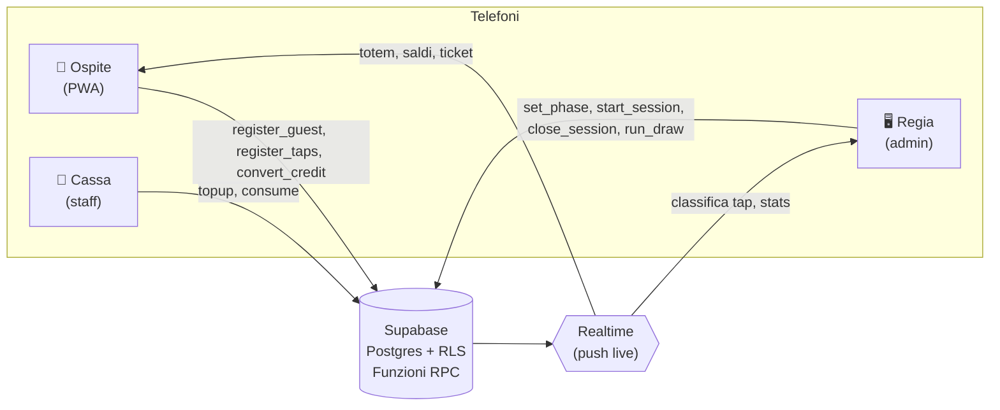
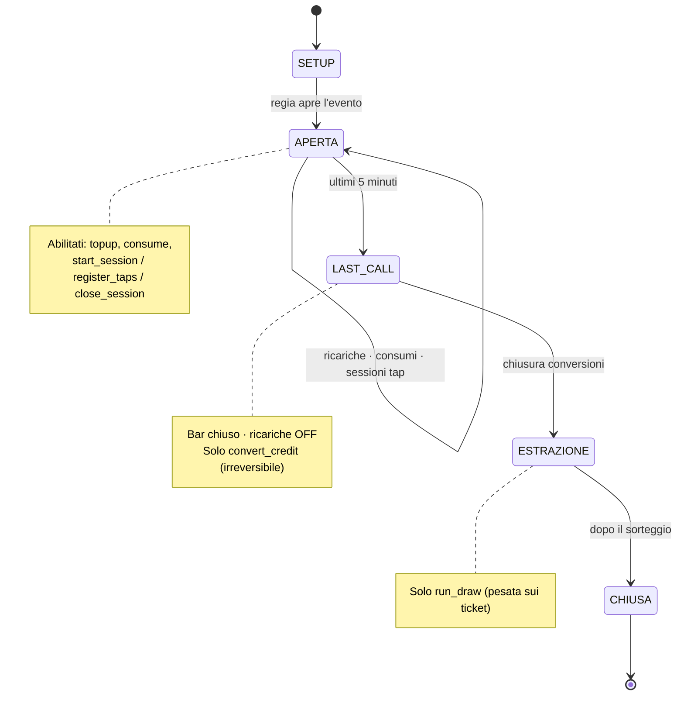
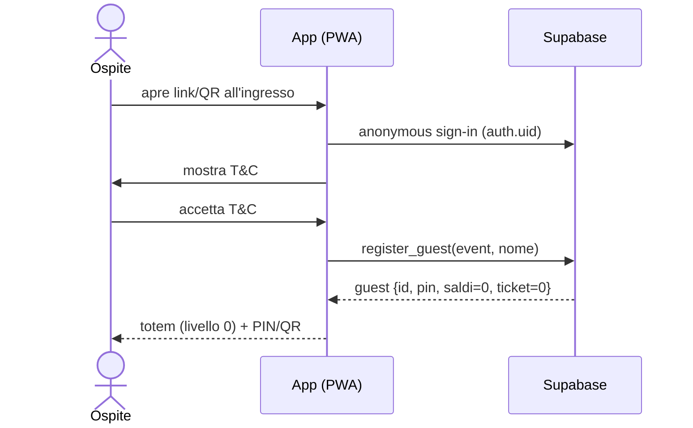
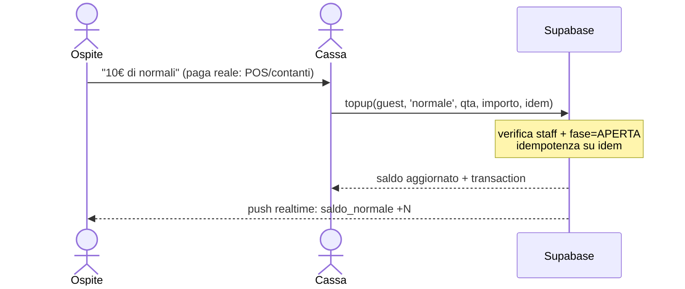
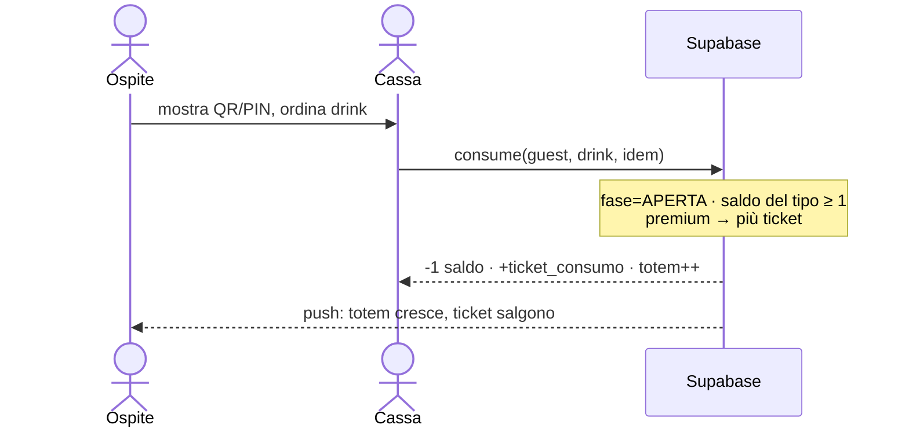
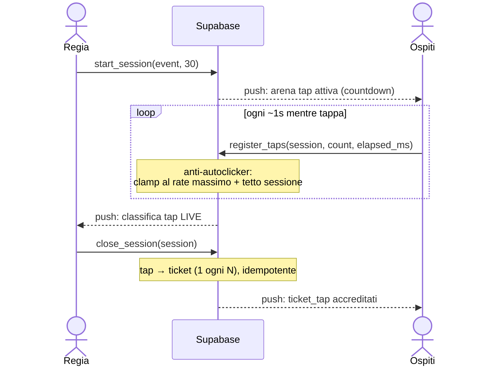
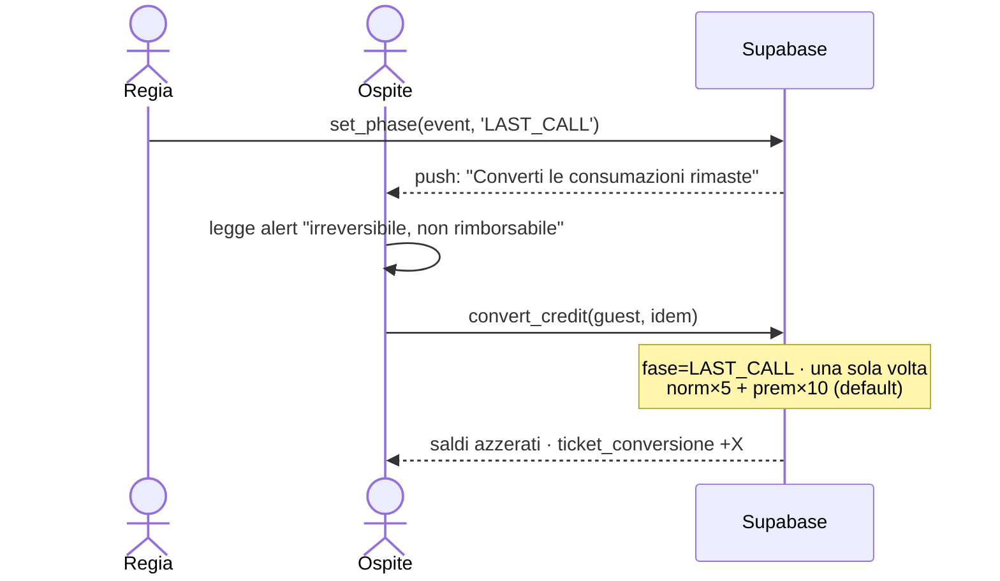
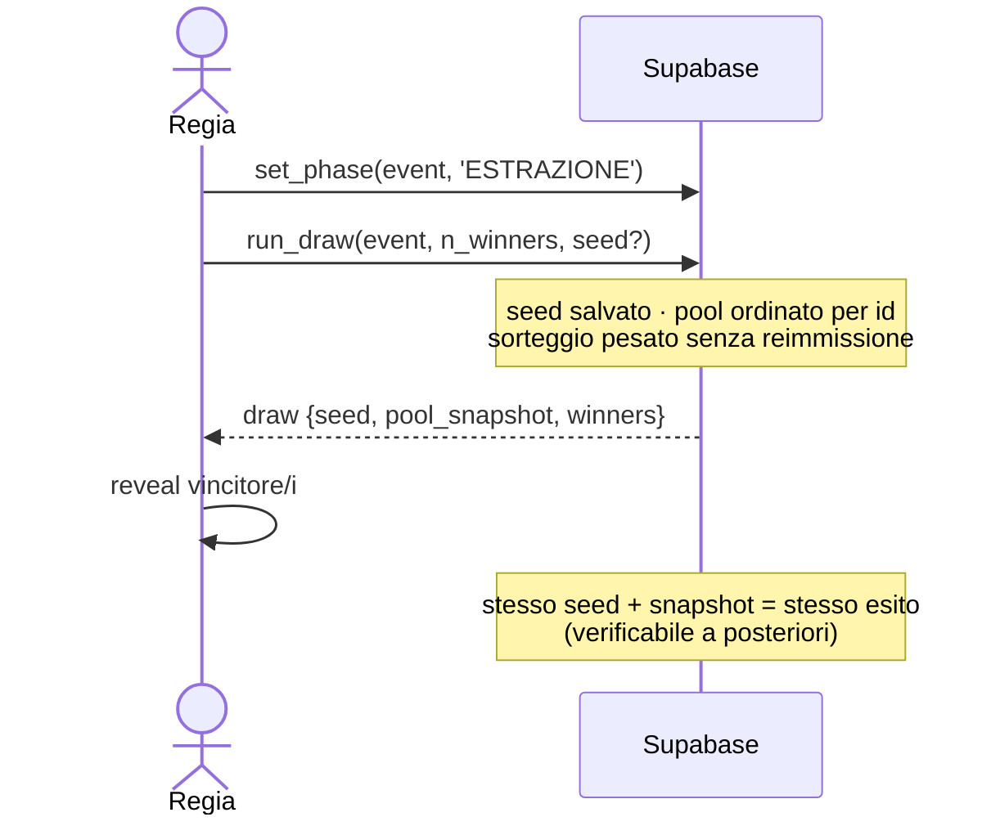

# TOTEM NIGHT — Flussi e macchina a fasi

> Diagrammi Mermaid che mappano 1:1 le funzioni RPC dello schema (`totem-night_db_schema.sql`).
> Ogni freccia verso il DB corrisponde a una funzione server-authoritative.

## Mappa flusso → RPC

| Flusso | Chi lo avvia | RPC chiamata |
|---|---|---|
| Onboarding ospite | Ospite | `register_guest(event, nome)` |
| Ricarica credito | Cassa | `topup(guest, tipo, qta, importo, idem)` |
| Consumo al bar | Cassa | `consume(guest, drink, idem)` |
| Cambio fase serata | Regia | `set_phase(event, phase)` |
| Avvio sessione tap | Regia | `start_session(event, durata)` |
| Registra tap | Ospite | `register_taps(session, count, elapsed_ms)` |
| Chiusura sessione | Regia | `close_session(session)` |
| Conversione finale | Ospite / Staff | `convert_credit(guest, idem)` |
| Estrazione | Regia | `run_draw(event, n_winners, seed)` |

---

## 1) Mappa ruoli e sistema

---

## 2) Macchina a fasi della serata

---

## 3) Onboarding ospite

---

## 4) Ricarica credito (denaro reale → consumazioni)

---

## 5) Consumo al bar (1 gettone del tipo → ticket + totem)

---

## 6) Sessione di tap (30s, lanciata dalla regia)

---

## 7) Conversione finale (LAST_CALL, irreversibile)

---

## 8) Estrazione pesata (provably fair)

---

### Note di lettura
- Le frecce **verso il DB** sono sempre funzioni RPC `SECURITY DEFINER`: i client non scrivono mai direttamente su saldi/ticket.
- I **push realtime** sono cambi di riga propagati da Supabase Realtime; nessuna logica di gioco vive sul client.
- `idem` = chiave di idempotenza generata dal client: rende sicuri i retry su rete instabile.
